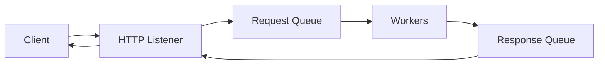

# OpenHQM - HTTP Queue Message Handler

[](https://www.python.org/downloads/)
[](LICENSE)
[](https://github.com/fok666/openhqm/actions)
[](docs/MULTI_ARCH_BUILD.md)

**OpenHQM** is an asynchronous HTTP request processing system that decouples request handling from response delivery using message queues. Deploy it as a **Kubernetes sidecar** to add async queue capabilities to legacy HTTP workloads **without changing code**, or use it as a standalone microservice for async processing.

> **💡 New: Sidecar/Envoy Pattern** - Add async processing to ANY HTTP application with zero code changes! Deploy OpenHQM as a K8s sidecar to modernize legacy apps, decouple scaling, and protect backends from traffic spikes. See [docs/SIDECAR_REVOLUTION.md](docs/SIDECAR_REVOLUTION.md) for details.

## 🚀 Features

- **Asynchronous Request Processing**: Submit HTTP requests and retrieve responses without blocking
- **Reverse Proxy Mode**: Configure workers to forward requests to any HTTP endpoint(s)
- **Kubernetes Sidecar Pattern**: Deploy as sidecar to add async queue capabilities to legacy HTTP workloads
- **Flexible Authentication**: Support for Bearer, API Key, Basic, and custom authentication
- **Transparent Header Forwarding**: Pass headers from client to backend seamlessly
- **7 Queue Backends + Custom**: Redis Streams, Kafka, AWS SQS, Azure Event Hubs, GCP Pub/Sub, MQTT, plus bring-your-own handler
- **Multi-Architecture Support**: Docker images for AMD64 and ARM64 (Intel, AMD, AWS Graviton, Apple Silicon)
- **8 Optimized Image Variants**: Queue-specific images 40-64% smaller than full build
- **Scalable Worker Pool**: Horizontally scalable workers for processing requests
- **Correlation Tracking**: Built-in request/response correlation with UUIDs
- **High Availability**: Fault-tolerant design with retry logic and dead letter queues
- **RESTful API**: Clean, well-documented API endpoints
- **Monitoring & Metrics**: Prometheus metrics and structured logging
- **Production Ready**: Docker support, health checks, and CI/CD pipelines

## 📚 Documentation

- **[Getting Started](docs/QUICKSTART.md)** - 5-minute quickstart guide
- **[Architecture & Design](SDD.md)** - Software Design Document
- **[Complete Documentation Index](docs/README.md)** - All documentation organized by topic

### Key Guides

- **[Composable Patterns](docs/COMPOSABLE_PATTERNS.md)** - HTTP→Queue and Queue→HTTP patterns
- **[Queue Backends](docs/QUEUE_BACKENDS.md)** - Guide for all 7 queue backends
- **[Kubernetes Sidecar](docs/KUBERNETES_SIDECAR.md)** - Deploy as K8s sidecar
- **[Proxy Mode](docs/PROXY_MODE.md)** - Reverse proxy configuration
- **[Docker Images](docs/DOCKER_IMAGES.md)** - Image variants and usage
- **[Multi-Arch Builds](docs/MULTI_ARCH_BUILD.md)** - Build for AMD64 & ARM64
- **[Quick Reference](docs/QUICK_REFERENCE.md)** - Command cheat sheet

## 📋 Table of Contents

- [Composable Patterns](#composable-patterns)
- [Architecture](#architecture)
- [Queue Backends](#queue-backends)
- [Quick Start](#quick-start)
- [Docker Images](#docker-images)
- [Configuration](#configuration)
- [API Usage](#api-usage)
- [Deployment](#deployment)
- [Contributing](#contributing)
- [License](#license)

## 🧩 Composable Patterns

OpenHQM implements **two fundamental patterns** that can be used independently or together:

### 1️⃣ HTTP → Queue (Ingress)
Accept HTTP requests and queue them for processing with custom logic.

### 2️⃣ Queue → HTTP (Egress)
Consume messages from a queue and forward to HTTP endpoints.

### 3️⃣ HTTP → Queue → HTTP (Combined)
Use both patterns together for full async reverse proxy capabilities.

**The power is in composition!** Mix and match patterns for your use case.

📖 **See [docs/COMPOSABLE_PATTERNS.md](docs/COMPOSABLE_PATTERNS.md) for detailed patterns, use cases, and configuration.**

## 🏗️ Architecture

OpenHQM follows a queue-based asynchronous processing pattern:



### Components

1. **HTTP Listener** (FastAPI): Accepts requests, generates correlation IDs, manages responses
2. **Message Queues**: Decouples request submission from processing (7 backends supported)
3. **Worker Pool**: Processes messages asynchronously with configurable concurrency
4. **Response Handler**: Matches responses to requests and delivers results

📖 **For detailed architecture, see [SDD.md](SDD.md) and [docs/ARCHITECTURE.md](docs/ARCHITECTURE.md)**

## 🎯 Kubernetes Sidecar Pattern

OpenHQM can be deployed as a **Kubernetes sidecar container** to modernize legacy HTTP-only applications without code changes. Add async processing, load shedding, and independent scaling to any application.

**Benefits:**
- ✅ **Zero code changes** to legacy applications
- ✅ **Independent scaling** - scale workers separately from app pods
- ✅ **Load shedding** - queue absorbs traffic spikes
- ✅ **Gradual migration** - modernize incrementally

📖 **See [docs/KUBERNETES_SIDECAR.md](docs/KUBERNETES_SIDECAR.md) and [docs/SIDECAR_REVOLUTION.md](docs/SIDECAR_REVOLUTION.md) for complete guide.**

## 🔄 Reverse Proxy Mode

OpenHQM functions as an **asynchronous reverse proxy**, forwarding requests to backend endpoints with full transparency:

- Multiple backend endpoints with routing
- Authentication management (Bearer, API Key, Basic, Custom)
- Transparent header forwarding
- Response caching with correlation tracking

📖 **See [docs/PROXY_MODE.md](docs/PROXY_MODE.md) for complete configuration guide.**

## 🔌 Queue Backends

OpenHQM supports **7 queue backends + custom handlers**:

| Backend | Use Case | Latency | Throughput |
|---------|----------|---------|------------|
| **Redis Streams** | Development, low latency | < 5ms | 100k+ msg/s |
| **Apache Kafka** | High throughput, streaming | 5-10ms | Millions/s |
| **AWS SQS** | Cloud-managed, serverless | 20-50ms | Thousands/s |
| **Azure Event Hubs** | Azure-native, Kafka-compatible | 10-30ms | Millions/s |
| **GCP Pub/Sub** | GCP-native, global scale | 20-100ms | Millions/s |
| **MQTT** | IoT, edge computing | < 10ms | Varies |
| **Custom** | Bring your own handler | Varies | Varies |

📖 **See [docs/QUEUE_BACKENDS.md](docs/QUEUE_BACKENDS.md) for complete configuration guide.**

## 🚀 Quick Start

### Using Docker (Recommended)

```bash
# Pull optimized image for your queue backend
docker pull ghcr.io/yourusername/openhqm:latest-redis

# Or build locally
./scripts/build-multiarch.sh --backend redis

# Run with Docker Compose
docker-compose up
```

### Local Development

```bash
# Clone and setup
git clone https://github.com/yourusername/openhqm.git
cd openhqm
python -m venv venv
source venv/bin/activate
pip install -r requirements.txt

# Run services
python -m openhqm.api.listener  # Terminal 1
python -m openhqm.worker.worker  # Terminal 2
```

### Test It

```bash
# Submit a request
curl -X POST http://localhost:8000/api/v1/submit \
  -H "Content-Type: application/json" \
  -d '{"payload": {"operation": "echo", "data": "Hello World"}}'

# Get the response (use correlation_id from response)
curl http://localhost:8000/api/v1/response/{correlation_id}
```

📖 **See [docs/QUICKSTART.md](docs/QUICKSTART.md) for detailed setup guide.**

## 🐳 Docker Images

OpenHQM provides **8 optimized image variants** with multi-architecture support (AMD64 & ARM64):

```bash
# Queue-specific images (40-64% smaller)
docker pull openhqm:latest-redis    # Redis only
docker pull openhqm:latest-sqs      # AWS SQS only
docker pull openhqm:latest-kafka    # Kafka only
docker pull openhqm:latest-azure    # Azure Event Hubs only
docker pull openhqm:latest-gcp      # GCP Pub/Sub only
docker pull openhqm:latest-mqtt     # MQTT only
docker pull openhqm:latest-minimal  # No queue deps
docker pull openhqm:latest          # All backends
```

**Build locally:**
```bash
# Build for your architecture
./scripts/build-multiarch.sh --backend redis

# Build for both AMD64 and ARM64
./scripts/build-multiarch.sh --backend redis --platforms linux/amd64,linux/arm64

# Build all variants
./scripts/build-multiarch.sh --build-all
```

📖 **See [docs/DOCKER_IMAGES.md](docs/DOCKER_IMAGES.md) and [docs/MULTI_ARCH_BUILD.md](docs/MULTI_ARCH_BUILD.md) for details.**

## ⚙️ Configuration

OpenHQM uses YAML configuration files and environment variables:

```yaml
queue:
  type: "redis"  # redis, kafka, sqs, azure_eventhubs, gcp_pubsub, mqtt, custom
  redis:
    url: "redis://localhost:6379"
  
proxy:
  enabled: true  # Enable reverse proxy mode
  default_endpoint: "http://localhost:8080"
  
worker:
  count: 5
  timeout_seconds: 300
```

Environment variables:
```bash
OPENHQM_QUEUE__TYPE=redis
OPENHQM_QUEUE__REDIS_URL=redis://localhost:6379
OPENHQM_PROXY__ENABLED=true
```

📖 **See [docs/QUEUE_BACKENDS.md](docs/QUEUE_BACKENDS.md) for complete configuration reference.**

## 📡 API Usage

### Submit Request

```bash
POST /api/v1/submit
Content-Type: application/json

{
  "payload": {
    "operation": "process",
    "data": {"key": "value"}
  },
  "metadata": {
    "priority": "normal",
    "timeout": 300
  }
}
```

**Response:**
```json
{
  "correlation_id": "550e8400-e29b-41d4-a716-446655440000",
  "status": "PENDING",
  "submitted_at": "2026-02-07T10:30:00Z"
}
```

### Check Status

```bash
GET /api/v1/status/{correlation_id}
```

**Response:**
```json
{
  "correlation_id": "550e8400-e29b-41d4-a716-446655440000",
  "status": "PROCESSING",
  "submitted_at": "2026-02-07T10:30:00Z",
  "updated_at": "2026-02-07T10:30:05Z"
}
```

### Retrieve Response

```bash
GET /api/v1/response/{correlation_id}
```

**Response:**
```json
{
  "correlation_id": "550e8400-e29b-41d4-a716-446655440000",
  "status": "COMPLETED",
  "result": {"output": "processed data"},
  "processing_time_ms": 1250,
  "completed_at": "2026-02-07T10:30:10Z"
}
```

## 🛠️ Development

### Project Structure

```
openhqm/
├── src/openhqm/           # Main package
│   ├── api/               # HTTP API layer
│   ├── queue/             # Queue implementations
│   ├── worker/            # Worker logic
│   ├── cache/             # Caching layer
│   └── config/            # Configuration
├── tests/                 # Test suite
├── docs/                  # Documentation
├── .github/workflows/     # CI/CD
└── docker/                # Docker configs
```

### Code Quality

```bash
# Format code
ruff format .

# Lint code
ruff check .

# Type checking
mypy src/

# Run tests
pytest tests/ -v --cov=openhqm

# Security check
bandit -r src/
```

### Adding a New Queue Backend

1. Implement the `MessageQueueInterface` in `src/openhqm/queue/`
2. Register the implementation in `queue/__init__.py`
3. Add configuration schema in `config/settings.py`
4. Write integration tests

## 🧪 Testing

```bash
# Run all tests
pytest

# Run with coverage
pytest --cov=openhqm --cov-report=html

# Run specific test suite
pytest tests/unit/
pytest tests/integration/
pytest tests/e2e/

# Run load tests
locust -f tests/load/locustfile.py
```

## 🚢 Deployment

### Docker

OpenHQM provides **8 optimized image variants** for different queue backends, with support for **linux/amd64** and **linux/arm64** architectures.

```bash
# Pull optimized image for your queue backend
docker pull ghcr.io/yourusername/openhqm:latest-redis  # Redis only
docker pull ghcr.io/yourusername/openhqm:latest-sqs    # AWS SQS only
docker pull ghcr.io/yourusername/openhqm:latest        # All backends

# Or build locally (auto-detects architecture)
docker build --build-arg QUEUE_BACKEND=redis -t openhqm:redis .

# Build for multiple architectures
./scripts/build-multiarch.sh --backend redis

# Run HTTP listener
docker run -p 8000:8000 openhqm:latest

# Run workers
docker run openhqm:latest worker
```

**See [docs/DOCKER_IMAGES.md](docs/DOCKER_IMAGES.md) for image variants and [docs/MULTI_ARCH_BUILD.md](docs/MULTI_ARCH_BUILD.md) for multi-architecture builds.**

### Kubernetes

```bash
# Apply manifests
kubectl apply -f k8s/

# Check deployment
kubectl get pods -n openhqm

# View logs
kubectl logs -f deployment/openhqm-api -n openhqm
```

**See [docs/KUBERNETES_SIDECAR.md](docs/KUBERNETES_SIDECAR.md) and [docs/DEPLOYMENT_PATTERNS.md](docs/DEPLOYMENT_PATTERNS.md) for deployment guides.**

### Docker Compose

```bash
# Start all services
docker-compose up -d

# Scale workers
docker-compose up -d --scale worker=10

# View logs
docker-compose logs -f

# Stop services
docker-compose down
```

## 📊 Monitoring

- **Prometheus Metrics**: `/metrics` endpoint
- **Health Checks**: `/health` endpoint
- **Structured Logging**: JSON logs with correlation IDs
- **Queue Depth Monitoring**: Worker autoscaling based on queue metrics

## 🤝 Contributing

We welcome contributions! Please see [CONTRIBUTING.md](CONTRIBUTING.md) for guidelines.

### Quick Start for Contributors

```bash
# Fork and clone
git clone https://github.com/yourusername/openhqm.git
cd openhqm

# Install dev dependencies
pip install -r requirements-dev.txt

# Run tests
pytest

# Submit PR
```

## 📄 License

MIT License - see [LICENSE](LICENSE) for details.

## 🔗 Links

- **Documentation**: [docs/README.md](docs/README.md)
- **Software Design**: [SDD.md](SDD.md)
- **Contributing**: [CONTRIBUTING.md](CONTRIBUTING.md)
- **Changelog**: [CHANGELOG.md](CHANGELOG.md)
- **Issues**: [GitHub Issues](https://github.com/yourusername/openhqm/issues)
- **Discussions**: [GitHub Discussions](https://github.com/yourusername/openhqm/discussions)

---

**OpenHQM** - Modernize any HTTP application with async queue processing. Deploy as a sidecar, standalone service, or reverse proxy. Zero code changes required. 🚀
