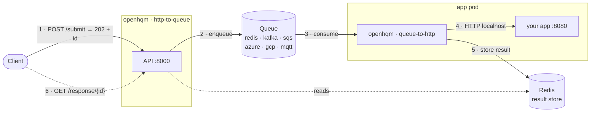

# OpenHQM — HTTP Queue Message Handler

[](https://www.python.org/downloads/)
[](LICENSE)

OpenHQM decouples HTTP request handling from response delivery using a message
queue. Deploy it as a **Kubernetes sidecar** to add async queue processing to an
HTTP workload without changing the app.

It does exactly two things — both ship in the same image, selected by argument:

| Mode | Command | Role |
| --- | --- | --- |
| **http-to-queue** | `python -m openhqm http-to-queue` | Accept HTTP, enqueue, serve poll results |
| **queue-to-http** | `python -m openhqm queue-to-http` | Consume queue, forward to your backend over HTTP |


```mermaid
flowchart LR
    client([Client])
    subgraph in ["openhqm · http-to-queue"]
        api["API :8000"]
    end
    q[("Queue<br/>redis · kafka · sqs<br/>azure · gcp · mqtt")]
    subgraph pod ["app pod"]
        worker["openhqm · queue-to-http"]
        backend["your app :8080"]
    end
    results[("Redis<br/>result store")]

    client -- "1 · POST /submit → 202 + id" --> api
    api -- "2 · enqueue" --> q
    q -- "3 · consume" --> worker
    worker -- "4 · HTTP localhost" --> backend
    worker -- "5 · store result" --> results
    client -. "6 · GET /response/{id}" .-> api
    api -. reads .-> results
```

Request state lives in the result store as `PENDING → PROCESSING → COMPLETED/FAILED`
(TTL'd, keyed by `correlation_id`). Failed messages are retried with backoff, then
land on a dead letter queue. Both modes drain gracefully on `SIGTERM`.

## Quick start

```bash
pip install -e .                          # core install = Redis backend
cp .env.example .env                      # defaults target redis://localhost:6379

# Terminal 1 — ingress (HTTP → queue)
python -m openhqm http-to-queue

# Terminal 2 — egress (queue → HTTP), pointed at your backend
OPENHQM_PROXY__BACKEND_URL=http://localhost:8080 python -m openhqm queue-to-http
```

```bash
# Submit a request
curl -sX POST http://localhost:8000/api/v1/submit \
  -H 'Content-Type: application/json' \
  -d '{"payload": {"hello": "world"}}'
# → {"correlation_id": "…", "status": "PENDING", ...}

# Poll for the result
curl http://localhost:8000/api/v1/response/<correlation_id>
```

Or run the whole loop with Docker: `docker compose up` (Redis + ingress + workers + an httpbin backend).

## API (http-to-queue mode)

| Method | Path | Description |
| --- | --- | --- |
| `POST` | `/api/v1/submit` | Enqueue a request, returns `202` + `correlation_id` |
| `GET` | `/api/v1/status/{id}` | Current status |
| `GET` | `/api/v1/response/{id}` | Result (`202` while still pending) |
| `GET` | `/health` | Liveness |
| `GET` | `/ready` | Readiness (queue + cache reachable) |
| `GET` | `/metrics` | Prometheus metrics |

## Queue backends

One pyproject extra per backend; the Docker `QUEUE_BACKEND` build arg uses the
same names to build slim per-backend images.

| Backend | Install | Config |
| --- | --- | --- |
| Redis Streams (default) | `pip install -e .` | `OPENHQM_QUEUE__TYPE=redis` |
| Apache Kafka | `pip install -e ".[kafka]"` | `OPENHQM_QUEUE__TYPE=kafka` |
| AWS SQS | `pip install -e ".[sqs]"` | `OPENHQM_QUEUE__TYPE=sqs` |
| Azure Event Hubs | `pip install -e ".[azure]"` | `OPENHQM_QUEUE__TYPE=azure_eventhubs` |
| GCP Pub/Sub | `pip install -e ".[gcp]"` | `OPENHQM_QUEUE__TYPE=gcp_pubsub` |
| MQTT | `pip install -e ".[mqtt]"` | `OPENHQM_QUEUE__TYPE=mqtt` |
| Bring your own | — | `OPENHQM_QUEUE__TYPE=custom` |

Per-backend settings, semantics, and how to write a custom adapter (a 4-method
class): [docs/QUEUE_BACKENDS.md](docs/QUEUE_BACKENDS.md).

## Configuration

Everything is an environment variable: prefix `OPENHQM_`, `__` for nesting.
All knobs live in one file — [`src/openhqm/config.py`](src/openhqm/config.py) —
and [`.env.example`](.env.example) lists them ready to copy. The ones that matter first:

```bash
OPENHQM_QUEUE__TYPE=redis                          # which backend
OPENHQM_QUEUE__REDIS_URL=redis://localhost:6379
OPENHQM_CACHE__REDIS_URL=redis://localhost:6379    # result store
OPENHQM_PROXY__BACKEND_URL=http://localhost:8080   # queue-to-http forward target
OPENHQM_WORKER__BATCH_SIZE=10                      # throughput knob
OPENHQM_CACHE__TTL_SECONDS=3600                    # how long results stay pollable
```

## Deployment

Runs as a sidecar behind a Kubernetes Gateway. See
[docs/DEPLOYMENT.md](docs/DEPLOYMENT.md) and
[`examples/kubernetes/gateway.yaml`](examples/kubernetes/gateway.yaml).

## Development

```bash
pip install -e ".[dev]"
pytest                # integration tests auto-skip without a local Redis
ruff check . && ruff format --check .
```

## License

MIT — see [LICENSE](LICENSE).
