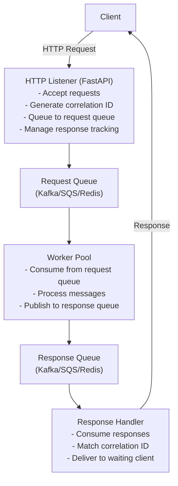
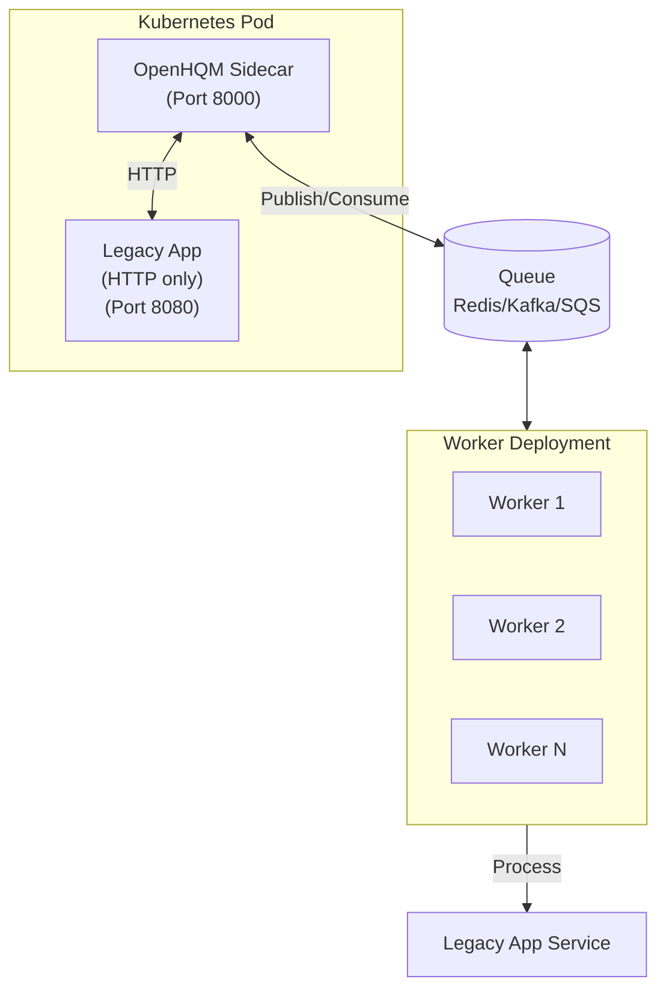

# Software Design Document (SDD)
## OpenHQM - HTTP Queue Message Handler

**Version:** 1.0
**Date:** February 7, 2026
**Status:** Initial Design

---

## 1. Executive Summary

OpenHQM is an asynchronous HTTP request processing system that decouples request handling from response delivery using message queues. It provides a scalable architecture for handling long-running operations without blocking HTTP connections.

### 1.1 Purpose
Enable asynchronous HTTP request processing through a queue-based worker architecture, allowing clients to submit requests and receive responses without maintaining persistent connections.

### 1.2 Scope
- HTTP API listener for request ingestion
- Message queue integration (Kafka/SQS/Redis)
- Worker pool for asynchronous processing
- Response queue and delivery mechanism
- Request correlation and tracking
- **Sidecar/Envoy Pattern**: Deploy as Kubernetes sidecar to add async queue capabilities to legacy HTTP workloads

---

## 2. Composable Patterns

### 2.1 Overview

OpenHQM is built on **two fundamental, composable patterns** that provide maximum architectural flexibility:

1. **HTTP → Queue (Ingress Pattern)**: Accept HTTP requests from clients and queue them for asynchronous processing
2. **Queue → HTTP (Egress Pattern)**: Consume messages from a queue and forward them as HTTP requests to backend endpoints

These patterns are **orthogonal** - they can be used independently or combined:

### 2.2 Pattern Combinations

**Pattern 1: HTTP → Queue Only** (Custom Processing)
- HTTP Listener accepts requests
- Messages queued to Redis/Kafka/SQS
- Workers run custom Python processing logic
- Use for: Event processing, ETL, notifications, batch jobs
- Configuration: `proxy.enabled = false`

**Pattern 2: Queue → HTTP Only** (Queue Consumer)
- No HTTP Listener (queue fed by external systems)
- Workers consume from queue
- Workers forward to configured HTTP endpoints
- Use for: Kafka-to-REST bridge, webhook relay, rate-limited API clients
- Configuration: `proxy.enabled = true`, no HTTP listener

**Pattern 3: HTTP → Queue → HTTP** (Full Proxy)
- HTTP Listener accepts requests
- Messages queued
- Workers consume and forward to HTTP endpoints
- Use for: Async reverse proxy, Kubernetes sidecar, load shedding
- Configuration: `proxy.enabled = true`, HTTP listener enabled

See [COMPOSABLE_PATTERNS.md](COMPOSABLE_PATTERNS.md) for detailed patterns, use cases, and configuration examples.

## 3. System Architecture

### 3.1 High-Level Architecture



### 3.2 Component Description

#### 3.2.1 HTTP Listener
- **Technology**: FastAPI
- **Responsibilities**:
  - Accept incoming HTTP POST requests
  - Generate unique correlation IDs (UUID)
  - Validate request payload
  - Queue requests to message broker
  - Provide polling endpoint for response retrieval
  - Support both sync (wait) and async (callback) modes
- **Endpoints**:
  - `POST /api/v1/submit` - Submit new request
  - `GET /api/v1/status/{correlation_id}` - Check request status
  - `GET /api/v1/response/{correlation_id}` - Retrieve response
  - `GET /health` - Health check endpoint
  - `GET /metrics` - Prometheus metrics

#### 3.2.2 Message Queue Layer
- **Technology**: Pluggable - 7 backends supported:
  - Redis Streams (in-memory, low latency)
  - Apache Kafka (distributed, high throughput)
  - AWS SQS (cloud-managed, serverless)
  - Azure Event Hubs (cloud-managed, Kafka-compatible)
  - GCP Pub/Sub (cloud-managed, global scale)
  - MQTT (IoT/edge computing)
  - Custom (bring your own handler)
- **Components**:
  - Request Queue: Incoming requests
  - Response Queue: Processed responses
- **Message Format**:
```json
{
  "correlation_id": "uuid-v4",
  "timestamp": "iso-8601",
  "payload": {},
  "metadata": {
    "retry_count": 0,
    "priority": "normal"
  }
}
```

#### 3.2.3 Worker Pool
- **Technology**: Python with asyncio
- **Responsibilities**:
  - Consume messages from request queue
  - Process business logic
  - Handle errors and retries
  - Publish results to response queue
- **Configuration**:
  - Configurable worker count
  - Graceful shutdown handling
  - Dead letter queue for failed messages

#### 3.2.4 Response Handler
- **Technology**: Integrated with HTTP Listener
- **Responsibilities**:
  - Consume responses from response queue
  - Match correlation IDs with pending requests
  - Store responses in cache (Redis)
  - Notify waiting clients (via WebSocket/SSE/polling)

---

## 4. Detailed Design

### 4.1 Data Models

#### 4.1.1 Request Model
```python
class Request(BaseModel):
    correlation_id: str
    payload: Dict[str, Any]
    metadata: RequestMetadata
    timestamp: datetime
    status: RequestStatus
```

#### 4.1.2 Response Model
```python
class Response(BaseModel):
    correlation_id: str
    result: Dict[str, Any]
    status: ResponseStatus
    timestamp: datetime
    processing_time_ms: int
```

#### 4.1.3 Request Status
- `PENDING`: Queued, not yet processed
- `PROCESSING`: Being processed by worker
- `COMPLETED`: Successfully processed
- `FAILED`: Processing failed
- `TIMEOUT`: Exceeded timeout limit

### 4.2 Message Queue Abstraction

```python
class MessageQueueInterface(ABC):
    @abstractmethod
    async def publish(self, queue_name: str, message: Dict) -> bool
    
    @abstractmethod
    async def consume(self, queue_name: str, handler: Callable) -> None
    
    @abstractmethod
    async def acknowledge(self, message_id: str) -> bool
```

Implementations:
- `RedisQueue`: Using Redis Streams
- `KafkaQueue`: Using aiokafka
- `SQSQueue`: Using boto3/aioboto3

### 4.3 Request Flow

1. **Client Submits Request**
   - Client sends POST to `/api/v1/submit`
   - Request includes payload and optional metadata
   
2. **HTTP Listener Processing**
   - Generate correlation_id (UUID v4)
   - Validate payload schema
   - Store request metadata in cache
   - Publish to request queue
   - Return correlation_id to client
   
3. **Worker Processing**
   - Worker consumes message from request queue
   - Update status to PROCESSING
   - Execute business logic (custom or HTTP proxy)
   - Handle errors with retry logic
   - Publish result to response queue
   - Acknowledge message
   
4. **Response Delivery**
   - Response handler consumes from response queue
   - Match correlation_id
   - Update status in cache
   - Store result in cache with TTL
   - Notify client (if using WebSocket/SSE)
   
5. **Client Retrieval**
   - Client polls `/api/v1/response/{correlation_id}`
   - Return cached response if available
   - Return status if still processing

### 4.4 Configuration Management

```yaml
# config.yaml
server:
  host: "0.0.0.0"
  port: 8000
  workers: 4

queue:
  type: "redis"  # redis, kafka, sqs
  connection:
    redis:
      url: "redis://localhost:6379"
    kafka:
      bootstrap_servers: ["localhost:9092"]
    sqs:
      region: "us-east-1"
      queue_url: ""

worker:
  count: 5
  batch_size: 10
  timeout_seconds: 300
  max_retries: 3

cache:
  type: "redis"
  ttl_seconds: 3600
  
monitoring:
  metrics_enabled: true
  log_level: "INFO"
```

### 4.5 Error Handling

- **Retry Logic**: Exponential backoff (1s, 2s, 4s)
- **Dead Letter Queue**: Failed messages after max retries
- **Circuit Breaker**: Prevent cascading failures
- **Graceful Degradation**: Continue operating with partial failures

### 4.6 Security Considerations

- **Authentication**: API key or JWT token
- **Rate Limiting**: Per client/IP rate limits
- **Input Validation**: Strict schema validation
- **Message Encryption**: Optional TLS for queues

---

## 5. Scalability & Performance

### 5.1 Horizontal Scaling
- HTTP listeners: Multiple instances behind load balancer
- Workers: Scale worker count based on queue depth
- Message queues: Native partitioning/sharding

### 5.2 Performance Targets
- Request ingestion: < 10ms
- Queue publish: < 50ms
- Worker processing: Depends on business logic
- Response retrieval: < 5ms (cached)

### 5.3 Monitoring & Observability
- Prometheus metrics
- Structured logging (JSON)
- Distributed tracing (OpenTelemetry)
- Health checks

---

## 6. Technology Stack

### 6.1 Core Technologies
- **Language**: Python 3.11+
- **HTTP Framework**: FastAPI
- **ASGI Server**: Uvicorn
- **Message Queues**: 7 backends supported (Redis, Kafka, SQS, Event Hubs, Pub/Sub, MQTT, Custom)
  - Primary: Redis Streams (recommended for development)
  - Production: Cloud-managed (SQS/Event Hubs/Pub/Sub) or Kafka
- **Cache**: Redis
- **Testing**: pytest, pytest-asyncio
- **Containerization**: Docker with multi-architecture support (AMD64, ARM64)

### 6.2 Key Libraries
- `fastapi`: Web framework
- `uvicorn[standard]`: ASGI server
- `redis`: Redis client with streams support (for Redis backend)
- `aiokafka`: Async Kafka client (for Kafka backend)
- `aioboto3`: Async AWS SDK (for SQS backend)
- `azure-eventhub`: Azure Event Hubs client (for Azure backend)
- `google-cloud-pubsub`: GCP Pub/Sub client (for GCP backend)
- `asyncio-mqtt`: Async MQTT client (for MQTT backend)
- `pydantic`: Data validation
- `pydantic-settings`: Configuration management
- `aiohttp`: Async HTTP client
- `prometheus-client`: Metrics
- `structlog`: Structured logging

### 6.3 Multi-Architecture Support
- **Platforms**: linux/amd64 (x86_64), linux/arm64 (aarch64)
- **Build Tool**: Docker Buildx with multi-platform support
- **Image Variants**: 8 optimized variants per architecture (all, redis, kafka, sqs, azure, gcp, mqtt, minimal)
- **CI/CD**: GitHub Actions with matrix builds for parallel multi-arch compilation
- **Size Optimization**: Queue-specific images reduce size by 40-64% vs full build

---

## 7. Development Guidelines

### 7.1 Code Structure
```
openhqm/
├── src/
│   ├── openhqm/
│   │   ├── __init__.py
│   │   ├── api/
│   │   │   ├── __init__.py
│   │   │   ├── listener.py
│   │   │   ├── routes.py
│   │   │   └── models.py
│   │   ├── queue/
│   │   │   ├── __init__.py
│   │   │   ├── interface.py
│   │   │   ├── redis_queue.py
│   │   │   ├── kafka_queue.py
│   │   │   └── sqs_queue.py
│   │   ├── worker/
│   │   │   ├── __init__.py
│   │   │   ├── worker.py
│   │   │   └── processor.py
│   │   ├── cache/
│   │   │   ├── __init__.py
│   │   │   └── redis_cache.py
│   │   ├── config/
│   │   │   ├── __init__.py
│   │   │   └── settings.py
│   │   └── utils/
│   │       ├── __init__.py
│   │       ├── logging.py
│   │       └── metrics.py
├── tests/
│   ├── unit/
│   ├── integration/
│   └── e2e/
├── docs/
├── .github/
│   └── workflows/
├── docker/
├── requirements.txt
├── requirements-dev.txt
├── pyproject.toml
├── Dockerfile
├── docker-compose.yml
└── README.md
```

### 7.2 Testing Strategy
- Unit tests: >80% coverage
- Integration tests: Queue and API integration
- E2E tests: Full request-response flow
- Load tests: Performance benchmarks

### 7.3 CI/CD Pipeline
- Linting: ruff, mypy
- Testing: pytest with coverage
- Security: bandit, safety
- Container builds: Docker multi-stage
- Deployment: Kubernetes manifests

---

## 8. Deployment

### 8.1 Container Deployment

#### 8.1.1 Docker Images
OpenHQM provides **8 optimized image variants** for different queue backends:
- **openhqm:latest** (or `:latest-all`) - Full build with all backends (~500MB)
- **openhqm:latest-redis** - Redis Streams only (~200MB, 60% smaller)
- **openhqm:latest-kafka** - Apache Kafka only (~250MB, 50% smaller)
- **openhqm:latest-sqs** - AWS SQS only (~230MB, 54% smaller)
- **openhqm:latest-azure** - Azure Event Hubs only (~280MB, 44% smaller)
- **openhqm:latest-gcp** - GCP Pub/Sub only (~270MB, 46% smaller)
- **openhqm:latest-mqtt** - MQTT only (~210MB, 58% smaller)
- **openhqm:latest-minimal** - No queue dependencies (~180MB, 64% smaller)

#### 8.1.2 Multi-Architecture Support
All image variants support multiple CPU architectures:
- **linux/amd64** (x86_64) - Intel/AMD processors
- **linux/arm64** (aarch64) - ARM processors, Apple Silicon

Docker automatically selects the correct architecture for your platform.

**Build locally:**
```bash
# Current architecture only (fast)
./scripts/build-multiarch.sh --backend redis --platforms linux/$(uname -m)

# Both architectures
./scripts/build-multiarch.sh --backend redis

# All variants
./scripts/build-multiarch.sh --build-all
```

**See [docs/DOCKER_IMAGES.md](docs/DOCKER_IMAGES.md) and [docs/MULTI_ARCH_BUILD.md](docs/MULTI_ARCH_BUILD.md) for details.**

#### 8.1.3 Local Development
- Docker Compose for local development
- Hot reload with volume mounts
- Local Redis/Kafka containers

#### 8.1.4 Production Deployment
- Kubernetes for production orchestration
- Multi-architecture support for cost optimization (AWS Graviton, Azure Ampere, GCP Tau)
- Horizontal pod autoscaling based on queue depth

### 8.2 Environment Configuration
- Environment variables for sensitive data
- ConfigMaps for configuration
- Secrets for credentials

---

## 9. API Specification

### 9.1 Submit Request
```
POST /api/v1/submit
Content-Type: application/json

Request:
{
  "payload": {
    "operation": "process",
    "data": {...}
  },
  "metadata": {
    "priority": "normal",
    "timeout": 300
  }
}

Response (202 Accepted):
{
  "correlation_id": "550e8400-e29b-41d4-a716-446655440000",
  "status": "PENDING",
  "submitted_at": "2026-02-07T10:30:00Z"
}
```

### 9.2 Get Status
```
GET /api/v1/status/{correlation_id}

Response (200 OK):
{
  "correlation_id": "550e8400-e29b-41d4-a716-446655440000",
  "status": "PROCESSING",
  "submitted_at": "2026-02-07T10:30:00Z",
  "updated_at": "2026-02-07T10:30:05Z"
}
```

### 9.3 Get Response
```
GET /api/v1/response/{correlation_id}

Response (200 OK):
{
  "correlation_id": "550e8400-e29b-41d4-a716-446655440000",
  "status": "COMPLETED",
  "result": {...},
  "processing_time_ms": 1250,
  "completed_at": "2026-02-07T10:30:10Z"
}
```

---

## 10. Future Enhancements

1. **WebSocket Support**: Real-time response delivery
2. **Batch Processing**: Submit multiple requests
3. **Priority Queues**: Different SLAs for different priority levels
4. **Request Chaining**: Link dependent requests
5. **Admin Dashboard**: Monitor queue health and metrics
6. **Multi-tenancy**: Isolated queues per tenant
7. **Additional Architectures**: Support for linux/386, linux/ppc64le, linux/s390x
8. **Platform-Specific Optimizations**: Architecture-specific performance tuning

---

## 11. Kubernetes Sidecar Pattern

### 11.1 Overview

OpenHQM can be deployed as a **Kubernetes sidecar container** to add queue-based async processing capabilities to legacy HTTP-only workloads without modifying application code. This pattern enables:

- **Decoupling from REST API logic**: Legacy apps remain synchronous, OpenHQM handles async
- **Horizontal scaling**: Scale queue workers independently from application pods
- **Load shedding**: Queue absorbs traffic spikes, protecting legacy applications
- **Zero code changes**: Pure infrastructure-level enhancement
- **Gradual migration**: Modernize incrementally without rewrites

### 11.2 Architecture



### 11.3 Use Cases

1. **Legacy Application Modernization**
   - Add async processing to synchronous REST APIs
   - No code changes required
   - Gradual migration path

2. **Load Protection**
   - Queue absorbs traffic spikes
   - Prevent overwhelming legacy backends
   - Graceful degradation under load

3. **Scaling Decoupling**
   - Scale frontend (sidecar) independently
   - Scale workers based on queue depth
   - Scale legacy app as needed

4. **Multi-tenancy**
   - Single legacy app, multiple queue backends
   - Isolate tenant workloads
   - Different SLAs per tenant

### 11.4 Deployment Example

```yaml
apiVersion: apps/v1
kind: Deployment
metadata:
  name: legacy-app-with-queue
spec:
  replicas: 3
  template:
    spec:
      containers:
      # OpenHQM Sidecar (ingress proxy)
      - name: openhqm-sidecar
        image: openhqm:latest
        command: ["python", "-m", "openhqm.api.listener"]
        ports:
        - containerPort: 8000
          name: http
        env:
        - name: OPENHQM_PROXY__ENABLED
          value: "true"
        - name: OPENHQM_PROXY__DEFAULT_ENDPOINT
          value: "http://localhost:8080"  # Legacy app
        - name: OPENHQM_QUEUE__TYPE
          value: "redis"
        - name: OPENHQM_QUEUE__REDIS_URL
          valueFrom:
            secretKeyRef:
              name: redis-credentials
              key: url
        resources:
          requests:
            cpu: 100m
            memory: 128Mi
          limits:
            cpu: 500m
            memory: 512Mi
      
      # Legacy Application (unchanged)
      - name: legacy-app
        image: legacy-app:v1.0
        ports:
        - containerPort: 8080
        resources:
          requests:
            cpu: 500m
            memory: 1Gi

---
# Separate worker deployment (scales independently)
apiVersion: apps/v1
kind: Deployment
metadata:
  name: openhqm-workers
spec:
  replicas: 10  # Scale based on queue depth
  template:
    spec:
      containers:
      - name: worker
        image: openhqm:latest
        command: ["python", "-m", "openhqm.worker.worker"]
        env:
        - name: OPENHQM_PROXY__ENABLED
          value: "true"
        - name: OPENHQM_PROXY__DEFAULT_ENDPOINT
          value: "http://legacy-app-service:8080"
        - name: OPENHQM_QUEUE__TYPE
          value: "redis"
        - name: OPENHQM_QUEUE__REDIS_URL
          valueFrom:
            secretKeyRef:
              name: redis-credentials
              key: url
```

### 11.5 Benefits

- **Zero Application Changes**: Legacy code untouched
- **Independent Scaling**: Scale workers separately from app pods
- **Traffic Management**: Queue-based rate limiting and load shedding
- **Observability**: Metrics and logging without app instrumentation
- **Fault Isolation**: Queue failures don't affect app deployment
- **Cost Optimization**: Scale workers to zero during low traffic

### 11.6 Configuration Pattern

```yaml
proxy:
  enabled: true
  default_endpoint: "http://localhost:8080"  # Same pod
  # Or external service:
  # default_endpoint: "http://legacy-service.namespace.svc.cluster.local:8080"
  
  forward_headers:
    - "Content-Type"
    - "Authorization"
    - "X-Request-ID"
  
  endpoints:
    legacy-app:
      url: "http://localhost:8080/api/v1/process"
      method: "POST"
      timeout: 300
```

### 11.7 Migration Strategy

**Phase 1: Sidecar Deployment**
- Deploy OpenHQM as sidecar
- Route traffic through sidecar
- Legacy app unchanged

**Phase 2: Gradual Adoption**
- Move high-latency operations to async
- Keep low-latency operations synchronous
- Monitor queue metrics

**Phase 3: Full Migration**
- All heavy operations async
- Scale workers independently
- Optimize legacy app for sync-only

---

## 12. Appendix

### 12.1 Glossary
- **Correlation ID**: Unique identifier linking request to response
- **Dead Letter Queue**: Queue for messages that failed processing
- **Idempotency**: Ability to process same request multiple times safely

### 12.2 References
- FastAPI Documentation: https://fastapi.tiangolo.com/
- Redis Streams: https://redis.io/docs/data-types/streams/
- Kafka Documentation: https://kafka.apache.org/documentation/
- AWS SQS: https://docs.aws.amazon.com/sqs/
- Docker Buildx: https://docs.docker.com/buildx/
- Multi-platform Images: https://docs.docker.com/build/building/multi-platform/

### 12.3 Internal Documentation
- **Architecture & Patterns**: [docs/COMPOSABLE_PATTERNS.md](docs/COMPOSABLE_PATTERNS.md)
- **Queue Backends**: [docs/QUEUE_BACKENDS.md](docs/QUEUE_BACKENDS.md)
- **Kubernetes Sidecar**: [docs/KUBERNETES_SIDECAR.md](docs/KUBERNETES_SIDECAR.md)
- **Proxy Mode**: [docs/PROXY_MODE.md](docs/PROXY_MODE.md)
- **Docker Images**: [docs/DOCKER_IMAGES.md](docs/DOCKER_IMAGES.md)
- **Multi-Arch Builds**: [docs/MULTI_ARCH_BUILD.md](docs/MULTI_ARCH_BUILD.md)
- **Quick Reference**: [docs/QUICK_REFERENCE.md](docs/QUICK_REFERENCE.md)
- **Complete Index**: [docs/README.md](docs/README.md)

### 12.4 Change Log
- 2026-02-07: Initial version 1.0
- 2026-02-07: Added Section 2 - Composable Patterns (HTTP→Queue, Queue→HTTP)
- 2026-02-07: Added Section 6.3 - Multi-Architecture Support
- 2026-02-07: Enhanced Section 8 - Container Deployment with multi-arch details
- 2026-02-07: Reorganized documentation into docs/ folder
