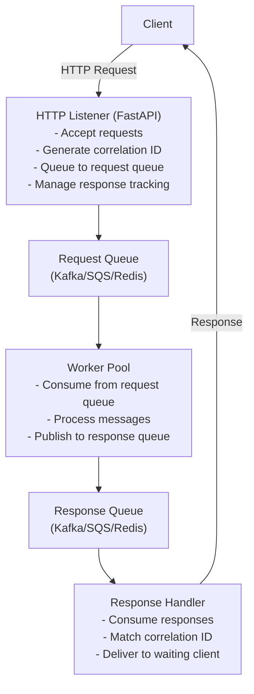
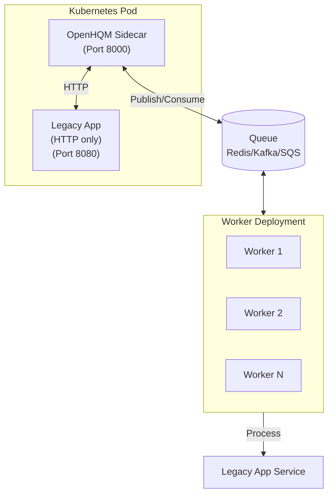

# Software Design Document (SDD)
## OpenHQM - HTTP Queue Message Handler

**Version:** 1.2
**Date:** February 15, 2026
**Status:** Updated with Enhanced Documentation

---

## 1. Executive Summary

OpenHQM is an asynchronous HTTP request processing system that decouples request handling from response delivery using message queues. It provides a scalable architecture for handling long-running operations without blocking HTTP connections.

### 1.1 Purpose
Enable asynchronous HTTP request processing through a queue-based worker architecture, allowing clients to submit requests and receive responses without maintaining persistent connections. Now enhanced with **routing capabilities** for dynamic message transformation and **partitioning** for session-aware processing.

### 1.2 Scope
- HTTP API listener for request ingestion
- Message queue integration (Kafka/SQS/Redis/Azure/GCP/MQTT)
- Worker pool for asynchronous processing
- Response queue and delivery mechanism
- Request correlation and tracking
- **Routing engine with JQ/JSONPath transforms**
- **Partitioning with session affinity**
- **Sidecar/Envoy Pattern**: Deploy as Kubernetes sidecar to add async queue capabilities to legacy HTTP workloads

---

## 2. Composable Patterns

### 2.1 Overview

OpenHQM is built on **two fundamental, composable patterns** that provide maximum architectural flexibility:

1. **HTTP → Queue (Ingress Pattern)**: Accept HTTP requests from clients and queue them for asynchronous processing
2. **Queue → HTTP (Egress Pattern)**: Consume messages from a queue and forward them as HTTP requests to backend endpoints

These patterns are **orthogonal** - they can be used independently or combined:

### 2.2 Pattern Combinations

**Pattern 1: HTTP → Queue Only** (Custom Processing)
- HTTP Listener accepts requests
- Messages queued to Redis/Kafka/SQS
- Workers run custom Python processing logic
- Use for: Event processing, ETL, notifications, batch jobs
- Configuration: `proxy.enabled = false`

**Pattern 2: Queue → HTTP Only** (Queue Consumer)
- No HTTP Listener (queue fed by external systems)
- Workers consume from queue
- Workers forward to configured HTTP endpoints
- Use for: Kafka-to-REST bridge, webhook relay, rate-limited API clients
- Configuration: `proxy.enabled = true`, no HTTP listener

**Pattern 3: HTTP → Queue → HTTP** (Full Proxy)
- HTTP Listener accepts requests
- Messages queued
- Workers consume and forward to HTTP endpoints
- Use for: Async reverse proxy, Kubernetes sidecar, load shedding
- Configuration: `proxy.enabled = true`, HTTP listener enabled

See [COMPOSABLE_PATTERNS.md](docs/COMPOSABLE_PATTERNS.md) for detailed patterns, use cases, and configuration examples.

## 3. System Architecture

### 3.1 High-Level Architecture



### 3.2 Component Description

#### 3.2.1 HTTP Listener
- **Technology**: FastAPI
- **Responsibilities**:
  - Accept incoming HTTP POST requests
  - Generate unique correlation IDs (UUID)
  - Validate request payload
  - Queue requests to message broker
  - Provide polling endpoint for response retrieval
  - Support both sync (wait) and async (callback) modes
- **Endpoints**:
  - `POST /api/v1/submit` - Submit new request
  - `GET /api/v1/status/{correlation_id}` - Check request status
  - `GET /api/v1/response/{correlation_id}` - Retrieve response
  - `GET /health` - Health check endpoint
  - `GET /metrics` - Prometheus metrics

#### 3.2.2 Message Queue Layer
- **Technology**: Pluggable - 7 backends supported:
  - Redis Streams (in-memory, low latency)
  - Apache Kafka (distributed, high throughput)
  - AWS SQS (cloud-managed, serverless)
  - Azure Event Hubs (cloud-managed, Kafka-compatible)
  - GCP Pub/Sub (cloud-managed, global scale)
  - MQTT (IoT/edge computing)
  - Custom (bring your own handler)
- **Components**:
  - Request Queue: Incoming requests
  - Response Queue: Processed responses
- **Message Format**:
```json
{
  "correlation_id": "uuid-v4",
  "timestamp": "iso-8601",
  "payload": {},
  "metadata": {
    "retry_count": 0,
    "priority": "normal"
  }
}
```

#### 3.2.3 Worker Pool
- **Technology**: Python with asyncio
- **Apply routing and transformation logic
  - Manage partition assignments for session affinity
  - Process business logic or forward to endpoints
  - Handle errors and retries
  - Publish results to response queue
- **Configuration**:
  - Configurable worker count
  - Graceful shutdown handling
  - Dead letter queue for failed messages
  - Partition assignment and rebalancing

#### 3.2.4 Routing Engine
- **Technology**: Python with pyjq (JQ) and jsonpath-ng
- **Responsibilities**:
  - Match messages to routes based on field values or patterns
  - Transform payloads using JQ, JSONPath, or templates
  - Map message fields to HTTP headers and query parameters
  - Select target endpoints dynamically
  - Override timeouts and retry settings per route
- **Configuration**:
  - YAML or JSON route configuration files
  - Kubernetes ConfigMap support
  - Priority-based route evaluation
  - Fallback to default endpoint

#### 3.2.5 Partition Manager
- **Technology**: Python with consistent hashing
- **Responsibilities**:
  - Assign partitions to workers for session affinity
  - Track active sessions with TTL
  - Ensure messages with same partition key go to same worker
  - Support multiple partitioning strategies (hash, sticky, round-robin)
  - Rebalance on worker scale changes
- **Use Case**: Enable horizontal scaling for legacy apps lacking session management
  - Dead letter queue for failed messages

#### 3.2.6 Response Handler
- **Technology**: Integrated with HTTP Listener
- **Responsibilities**:
  - Consume responses from response queue
  - Match correlation IDs with pending requests
  - Store responses in cache (Redis)
  - Notify waiting clients (via WebSocket/SSE/polling)

---

## 4. Detailed Design

### 4.1 Routing and Transformation

#### 4.1.1 Routing Engine

The routing engine enables dynamic message transformation and endpoint selection based on message content.

**Features:**
- **Multiple Transform Types**: JQ, JSONPath, Template, Passthrough
- **Flexible Matching**: Field values, regex patterns, priority-based
- **Header/Query Mapping**: Map message fields to HTTP headers and query parameters
- **Per-Route Overrides**: Timeouts, retries, HTTP methods

**Configuration Example:**
```yaml
version: "1.0"
routes:
  - name: user-registration
    match_field: "metadata.type"
    match_value: "user.register"
    priority: 10
    endpoint: "user-service"
    transform_type: "jq"
    transform: |
      {
        "username": .payload.email | split("@")[0],
        "email": .payload.email,
        "full_name": .payload.name
      }
    header_mappings:
      X-Request-ID: "correlation_id"
```

**Transform Types:**

1. **JQ Transform**: Complex JSON transformations
   ```jq
   {
     "user_id": .payload.user.id,
     "items": [.payload.cart.items[] | {
       "sku": .product_id,
       "qty": .quantity
     }]
   }
   ```

2. **JSONPath**: Extract specific fields
   ```
   $.payload.event.data
   ```

3. **Template**: Simple field substitution
   ```json
   {
     "recipient": "{{payload.user.email}}",
     "subject": "{{payload.subject}}"
   }
   ```

4. **Passthrough**: No transformation (forward as-is)

#### 4.1.2 Route Matching

Routes are evaluated in **priority order**:
1. Sort routes by priority (highest first)
2. Check enabled routes only
3. Match field values or regex patterns
4. First match wins
5. Fallback to default route if configured

**Matching Criteria:**
- `match_field`: Dot-notation path to field (e.g., "metadata.type")
- `match_value`: Exact string match
- `match_pattern`: Regex pattern
- `is_default`: Matches all messages (lowest priority)

### 4.2 Partitioning and Session Affinity

#### 4.2.1 Partition Manager

The partition manager ensures messages with the same partition key are always processed by the same worker instance, enabling session management for legacy applications.

**Features:**
- **Sticky Sessions**: Consistent partition assignment based on key
- **Multiple Strategies**: HASH, STICKY, KEY, ROUND_ROBIN
- **Worker Coordination**: Automatic partition distribution
- **Session Tracking**: TTL-based session cleanup
- **Rebalancing**: On worker scale up/down

**Configuration:**
```bash
OPENHQM_PARTITIONING__ENABLED=true
OPENHQM_PARTITIONING__PARTITION_COUNT=10
OPENHQM_PARTITIONING__STRATEGY=sticky
OPENHQM_PARTITIONING__PARTITION_KEY_FIELD=metadata.session_id
OPENHQM_PARTITIONING__STICKY_SESSION_TTL=3600
```

**Partition Assignment:**

With 10 partitions and 5 workers:
```
Worker 0: Partitions [0, 5]
Worker 1: Partitions [1, 6]
Worker 2: Partitions [2, 7]
Worker 3: Partitions [3, 8]
Worker 4: Partitions [4, 9]
```

Each message's partition is determined by:
```python
partition_id = hash(partition_key) % partition_count
```

**Message Flow:**
1. Extract partition key from message (e.g., `metadata.session_id`)
2. Calculate partition ID using consistent hashing
3. Check if this worker owns the partition
4. Process if owned, skip if not
5. Track session activity for sticky sessions

#### 4.2.2 Use Cases

**Legacy Application Horizontal Scaling:**
- Legacy app has in-memory sessions
- Can't scale horizontally without state sharing
- OpenHQM ensures same session → same worker
- Worker forwards to legacy app instance
- Legacy app maintains local session state

**Multi-Tenant Workloads:**
- Partition by tenant ID
- Isolate tenant workloads
- Predictable resource allocation
- Per-tenant rate limiting

**Stateful Processing:**
- Maintain worker-local state
- Avoid distributed state management
- Reduce latency for session-bound operations

### 4.3 Data Models

#### 4.3.1 Route Model
```python
class Route(BaseModel):
    name: str
    match_field: str | None
    match_value: str | None
    match_pattern: str | None
    is_default: bool = False
    priority: int = 0
    endpoint: str
    transform_type: TransformType
    transform: str | None
    method: str | None
    header_mappings: dict[str, str] | None
    query_params: dict[str, str] | None
    timeout: int | None
    max_retries: int | None
```

#### 4.3.2 Partition Config
```python
class PartitionConfig(BaseModel):
    enabled: bool = False
    strategy: PartitionStrategy = PartitionStrategy.STICKY
    partition_count: int = 10
    partition_key_field: str = "metadata.partition_key"
    session_key_field: str = "metadata.session_id"
    sticky_session_ttl: int = 3600
```

### 4.4 Request Flow with Routing and Partitioning

1. **Client Submits Request**
   - HTTP POST to `/api/v1/submit`
   - Includes payload, metadata, headers
   
2. **HTTP Listener Processing**
   - Generate correlation_id
   - Publish to request queue
   - Return correlation_id to client
   
3. **Worker Receives Message**
   - Check partition assignment (if enabled)
   - Skip if not owned by this worker
   - Track session activity
   
4. **Routing Engine**
   - Match message to route
   - Apply transformation (JQ/JSONPath/Template)
   - Map fields to headers/query params
   - Select target endpoint
   
5. **Worker Forwards Request**
   - Build HTTP request from routing result
   - Forward to configured endpoint
   - Capture response
   
6. **Response Handling**
   - Publish to response queue
   - Store in cache
   - Client polls for result

---

## 5. Detailed Design (Continued)

### 5.1 Data Models

#### 5.1.1 Request Model
```python
class SubmitRequest(BaseModel):
    """Request model for submitting a new request."""
    payload: Dict[str, Any]  # Request payload
    headers: Dict[str, str] | None  # HTTP headers to forward
    metadata: RequestMetadata | None  # Request metadata
```

#### 5.1.2 Request Metadata
```python
class RequestMetadata(BaseModel):
    """Metadata for request processing."""
    priority: int = 0  # Priority level (0-9)
    timeout: int = 300  # Timeout in seconds
    retry_count: int = 0  # Current retry count
    endpoint: str | None  # Target endpoint name
    method: str | None  # HTTP method override
```

#### 5.1.3 Response Model
```python
class ResultResponse(BaseModel):
    """Response model for result retrieval."""
    correlation_id: str  # Unique correlation ID
    status: RequestStatus  # Final status
    result: Dict[str, Any] | None  # Processing result
    headers: Dict[str, str] | None  # Response headers from worker
    status_code: int | None  # HTTP status code from worker
    error: str | None  # Error message if failed
    processing_time_ms: int | None  # Processing time in milliseconds
    completed_at: datetime | None  # Completion timestamp
```

#### 5.1.4 Request Status
- `PENDING`: Queued, not yet processed
- `PROCESSING`: Being processed by worker
- `COMPLETED`: Successfully processed
- `FAILED`: Processing failed
- `TIMEOUT`: Exceeded timeout limit

#### 5.1.5 Endpoint Configuration
```python
class EndpointConfig(BaseModel):
    """Configuration for a single endpoint."""
    url: str  # Target endpoint URL
    method: str = "POST"  # HTTP method to use
    timeout: int = 300  # Request timeout in seconds
    headers: Dict[str, str] | None  # Static headers to include
    auth_type: Literal["bearer", "basic", "api_key", "custom"] | None
    auth_token: str | None  # Auth token for bearer/api_key
    auth_username: str | None  # Username for basic auth
    auth_password: str | None  # Password for basic auth
    auth_header_name: str | None  # Header name for custom auth
```

### 5.2 Message Queue Abstraction

```python
class MessageQueueInterface(ABC):
    @abstractmethod
    async def publish(self, queue_name: str, message: Dict) -> bool
    
    @abstractmethod
    async def consume(self, queue_name: str, handler: Callable) -> None
    
    @abstractmethod
    async def acknowledge(self, message_id: str) -> bool
```

Implementations:
- `RedisQueue`: Using Redis Streams
- `KafkaQueue`: Using aiokafka
- `SQSQueue`: Using boto3/aioboto3

### 5.3 Request Flow

1. **Client Submits Request**
   - Client sends POST to `/api/v1/submit`
   - Request includes payload and optional metadata
   
2. **HTTP Listener Processing**
   - Generate correlation_id (UUID v4)
   - Validate payload schema
   - Store request metadata in cache
   - Publish to request queue
   - Return correlation_id to client
   
3. **Worker Processing**
   - Worker consumes message from request queue
   - Update status to PROCESSING
   - Execute business logic (custom or HTTP proxy)
   - Handle errors with retry logic
   - Publish result to response queue
   - Acknowledge message
   
4. **Response Delivery**
   - Response handler consumes from response queue
   - Match correlation_id
   - Update status in cache
   - Store result in cache with TTL
   - Notify client (if using WebSocket/SSE)
   
5. **Client Retrieval**
   - Client polls `/api/v1/response/{correlation_id}`
   - Return cached response if available
   - Return status if still processing

### 5.4 Configuration Management

OpenHQM uses **pydantic-settings** for configuration with environment variable support. Configuration can be provided via:
- Environment variables (prefixed with `OPENHQM_`)
- `.env` file
- Inline programmatic settings

#### 5.4.1 Environment Variable Convention

Use double underscores (`__`) for nested settings:
```bash
# Server settings
OPENHQM_SERVER__HOST=0.0.0.0
OPENHQM_SERVER__PORT=8000
OPENHQM_SERVER__WORKERS=4

# Queue settings
OPENHQM_QUEUE__TYPE=redis
OPENHQM_QUEUE__REDIS_URL=redis://localhost:6379
OPENHQM_QUEUE__REQUEST_QUEUE_NAME=openhqm-requests
OPENHQM_QUEUE__RESPONSE_QUEUE_NAME=openhqm-responses

# Worker settings
OPENHQM_WORKER__COUNT=5
OPENHQM_WORKER__BATCH_SIZE=10
OPENHQM_WORKER__TIMEOUT_SECONDS=300
OPENHQM_WORKER__MAX_RETRIES=3

# Proxy settings
OPENHQM_PROXY__ENABLED=true
OPENHQM_PROXY__DEFAULT_ENDPOINT=http://backend:8080

# Cache settings
OPENHQM_CACHE__TYPE=redis
OPENHQM_CACHE__REDIS_URL=redis://localhost:6379
OPENHQM_CACHE__TTL_SECONDS=3600

# Monitoring settings
OPENHQM_MONITORING__METRICS_ENABLED=true
OPENHQM_MONITORING__LOG_LEVEL=INFO
OPENHQM_MONITORING__LOG_FORMAT=json

# Routing settings
OPENHQM_ROUTING__ENABLED=true
OPENHQM_ROUTING__CONFIG_PATH=/config/routing.yaml

# Partitioning settings
OPENHQM_PARTITIONING__ENABLED=true
OPENHQM_PARTITIONING__PARTITION_COUNT=10
OPENHQM_PARTITIONING__STRATEGY=sticky
```

#### 5.4.2 Queue Backend Configurations

**Redis Streams:**
```bash
OPENHQM_QUEUE__TYPE=redis
OPENHQM_QUEUE__REDIS_URL=redis://localhost:6379
```

**Apache Kafka:**
```bash
OPENHQM_QUEUE__TYPE=kafka
OPENHQM_QUEUE__KAFKA_BOOTSTRAP_SERVERS=broker1:9092,broker2:9092
OPENHQM_QUEUE__KAFKA_CONSUMER_GROUP=openhqm-workers
OPENHQM_QUEUE__KAFKA_TOPICS=["openhqm-requests"]
```

**AWS SQS:**
```bash
OPENHQM_QUEUE__TYPE=sqs
OPENHQM_QUEUE__SQS_REGION=us-east-1
OPENHQM_QUEUE__SQS_QUEUE_URL=https://sqs.us-east-1.amazonaws.com/123456789/openhqm-requests
```

**Azure Event Hubs:**
```bash
OPENHQM_QUEUE__TYPE=azure_eventhubs
OPENHQM_QUEUE__AZURE_EVENTHUBS_CONNECTION_STRING=Endpoint=sb://...
OPENHQM_QUEUE__AZURE_EVENTHUBS_NAME=openhqm
OPENHQM_QUEUE__AZURE_EVENTHUBS_CONSUMER_GROUP=$Default
```

**GCP Pub/Sub:**
```bash
OPENHQM_QUEUE__TYPE=gcp_pubsub
OPENHQM_QUEUE__GCP_PROJECT_ID=my-project
OPENHQM_QUEUE__GCP_CREDENTIALS_PATH=/secrets/gcp-sa.json
```

**MQTT:**
```bash
OPENHQM_QUEUE__TYPE=mqtt
OPENHQM_QUEUE__MQTT_BROKER_HOST=broker.hivemq.com
OPENHQM_QUEUE__MQTT_BROKER_PORT=1883
OPENHQM_QUEUE__MQTT_QOS=1
```

**Custom Handler:**
```bash
OPENHQM_QUEUE__TYPE=custom
OPENHQM_QUEUE__CUSTOM_MODULE=myapp.queues
OPENHQM_QUEUE__CUSTOM_CLASS=MyQueueHandler
```

### 5.5 Error Handling

#### 5.5.1 Exception Hierarchy

```python
OpenHQMError (Base Exception)
├── QueueError - Queue operation failures
├── ValidationError - Input validation failures
├── ProcessingError - Processing failures
│   ├── RetryableError - Can be retried
│   └── FatalError - Should not be retried
├── ConfigurationError - Configuration issues
└── TimeoutError - Operation timeouts
```

**Exception Usage:**
- `RetryableError`: Transient failures (network issues, temporary backend unavailability)
- `FatalError`: Permanent failures (invalid payload, authorization failures)
- `QueueError`: Queue connection issues, publish failures
- `ValidationError`: Schema validation, bad input
- `TimeoutError`: Processing or HTTP request timeouts

#### 5.5.2 Retry Logic

**Exponential Backoff Strategy:**
```python
retry_delay = min(
    base_delay * (2 ** attempt),
    max_delay
)
```

**Default Configuration:**
- `base_delay`: 1.0 seconds
- `max_delay`: 60.0 seconds
- `max_retries`: 3 attempts

**Retry Schedule Example:**
- Attempt 1: Immediate
- Attempt 2: Wait 1s
- Attempt 3: Wait 2s
- Attempt 4: Wait 4s
- After 3 retries: Move to DLQ

**Configurable Per-Endpoint:**
```bash
OPENHQM_WORKER__MAX_RETRIES=3
OPENHQM_WORKER__RETRY_DELAY_BASE=1.0
OPENHQM_WORKER__RETRY_DELAY_MAX=60.0
```

#### 5.5.3 Dead Letter Queue (DLQ)

**Purpose:** Store messages that fail after max retry attempts

**DLQ Message Format:**
```json
{
  "original_message": {...},
  "correlation_id": "550e8400-e29b-41d4-a716-446655440000",
  "error": "Connection refused to backend",
  "retry_count": 3,
  "last_attempt": "2026-02-15T10:30:00Z",
  "queue_name": "openhqm-dlq"
}
```

**DLQ Processing:**
1. Automatic: Failed messages moved to DLQ queue
2. Manual: Admin reviews and requeues or discards
3. Monitoring: Alerts on DLQ depth exceeding threshold

#### 5.5.4 Circuit Breaker

**State Machine:**
- `CLOSED`: Normal operation, requests forwarded
- `OPEN`: Too many failures, requests rejected immediately
- `HALF_OPEN`: Test if system recovered, allow limited requests

**Configuration (Future Enhancement):**
```python
circuit_breaker_config = {
    "failure_threshold": 5,  # Open after 5 failures
    "timeout": 60,  # Stay open for 60 seconds
    "expected_exception": RetryableError
}
```

**Behavior:**
- Track failure rate per endpoint
- Open circuit after threshold exceeded
- Prevent cascading failures to backend
- Automatically close after recovery period

#### 5.5.5 Graceful Degradation

**Strategies:**
1. **Queue Overflow**: Return 429 Too Many Requests if queue at capacity
2. **Backend Down**: Store in queue, retry later
3. **Cache Unavailable**: Continue without caching (log warning)
4. **Single Worker Failure**: Other workers continue processing
5. **Partial Queue Failure**: Fallback to alternative queue backend (if configured)

#### 5.5.6 Error Response Format

**API Error Responses:**
```json
{
  "error": {
    "code": "PROCESSING_FAILED",
    "message": "Failed to process request",
    "correlation_id": "550e8400-e29b-41d4-a716-446655440000",
    "timestamp": "2026-02-15T10:30:00Z",
    "details": {
      "retry_count": 3,
      "last_error": "Connection timeout"
    }
  }
}
```

**Error Codes:**
- `VALIDATION_ERROR`: Invalid input (400)
- `NOT_FOUND`: Correlation ID not found (404)
- `TIMEOUT`: Processing timeout (408)
- `QUEUE_FULL`: Queue capacity exceeded (429)
- `PROCESSING_FAILED`: Worker processing failure (500)
- `QUEUE_ERROR`: Queue unavailable (503)

### 5.6 Security Considerations

#### 5.6.1 Authentication & Authorization

**API Authentication:**
- **Bearer Token**: Standard OAuth2 bearer tokens
  ```bash
  OPENHQM_PROXY__ENDPOINTS__API1__AUTH_TYPE=bearer
  OPENHQM_PROXY__ENDPOINTS__API1__AUTH_TOKEN=your-token-here
  ```
- **API Key**: Custom header-based API keys
  ```bash
  OPENHQM_PROXY__ENDPOINTS__API2__AUTH_TYPE=api_key
  OPENHQM_PROXY__ENDPOINTS__API2__AUTH_HEADER_NAME=X-API-Key
  OPENHQM_PROXY__ENDPOINTS__API2__AUTH_TOKEN=your-api-key
  ```
- **Basic Auth**: HTTP basic authentication
  ```bash
  OPENHQM_PROXY__ENDPOINTS__API3__AUTH_TYPE=basic
  OPENHQM_PROXY__ENDPOINTS__API3__AUTH_USERNAME=user
  OPENHQM_PROXY__ENDPOINTS__API3__AUTH_PASSWORD=pass
  ```
- **Custom Auth**: Flexible header-based authentication
  ```bash
  OPENHQM_PROXY__ENDPOINTS__API4__AUTH_TYPE=custom
  OPENHQM_PROXY__ENDPOINTS__API4__AUTH_HEADER_NAME=X-Custom-Auth
  OPENHQM_PROXY__ENDPOINTS__API4__AUTH_TOKEN=custom-value
  ```

#### 5.6.2 Network Security

**TLS/SSL:**
- All queue connections should use TLS in production
- Redis: Use `rediss://` protocol
- Kafka: Enable SSL/SASL configuration
- HTTP endpoints: Use HTTPS URLs

**Network Policies (Kubernetes):**
```yaml
apiVersion: networking.k8s.io/v1
kind: NetworkPolicy
metadata:
  name: openhqm-network-policy
spec:
  podSelector:
    matchLabels:
      app: openhqm
  policyTypes:
  - Ingress
  - Egress
  ingress:
  - from:
    - podSelector:
        matchLabels:
          role: frontend
    ports:
    - protocol: TCP
      port: 8000
  egress:
  - to:
    - podSelector:
        matchLabels:
          app: redis
    ports:
    - protocol: TCP
      port: 6379
```

#### 5.6.3 Secrets Management

**Kubernetes Secrets:**
```yaml
apiVersion: v1
kind: Secret
metadata:
  name: openhqm-secrets
type: Opaque
stringData:
  redis-url: "redis://redis:6379"
  api-token: "secret-token-here"
```

**External Secrets (AWS Secrets Manager, Azure Key Vault, etc.):**
```yaml
apiVersion: external-secrets.io/v1beta1
kind: ExternalSecret
metadata:
  name: openhqm-external-secrets
spec:
  refreshInterval: 1h
  secretStoreRef:
    name: aws-secrets-manager
    kind: SecretStore
  target:
    name: openhqm-secrets
  data:
  - secretKey: redis-url
    remoteRef:
      key: openhqm/redis-url
```

#### 5.6.4 Input Validation

- **Pydantic Models**: All API inputs validated by Pydantic schemas
- **Payload Size Limits**: Default 10MB, configurable via `OPENHQM_PROXY__MAX_RESPONSE_SIZE`
- **Header Validation**: Whitelist of allowed headers via `forward_headers`
- **Message Sanitization**: Strip sensitive headers via `strip_headers`

#### 5.6.5 Rate Limiting

**API-level (FastAPI Middleware):**
```python
# Future enhancement - not yet implemented
from slowapi import Limiter, _rate_limit_exceeded_handler
from slowapi.util import get_remote_address

limiter = Limiter(key_func=get_remote_address)
app.state.limiter = limiter
app.add_exception_handler(RateLimitExceeded, _rate_limit_exceeded_handler)

@app.post("/api/v1/submit")
@limiter.limit("100/minute")
async def submit_request(request: Request):
    pass
```

**Queue-level:** Use backend-specific rate limiting (SQS message delay, Kafka quotas)

#### 5.6.6 Audit Logging

- **Correlation ID Tracking**: All requests traced via UUID correlation IDs
- **Structured Logging**: JSON format with sensitive data redaction
- **Log Retention**: Configure based on compliance requirements
- **Access Logs**: Capture all API accesses with client identification

#### 5.6.7 Security Best Practices

1. **Never log sensitive data**: Passwords, tokens, PII automatically redacted
2. **Use secrets management**: No hardcoded credentials in code or configs
3. **Principle of least privilege**: Service accounts with minimal permissions
4. **Keep dependencies updated**: Use Dependabot for security patches
5. **Scan container images**: Use Trivy or similar for vulnerability scanning
6. **Enable mTLS**: Mutual TLS for service-to-service communication in production

---

## 6. Non-Functional Requirements

### 6.1 Performance Requirements

#### 6.1.1 Latency Targets
- **Request Ingestion** (HTTP → Queue): < 10ms (p95)
- **Queue Publish**: < 50ms (p95)
- **Worker Processing** (without backend): < 100ms (p95)
- **End-to-End** (with backend): < backend_latency + 200ms (p95)
- **Response Retrieval** (cached): < 5ms (p95)

#### 6.1.2 Throughput Targets
- **API Ingestion**: 10,000 requests/second per instance
- **Worker Processing**: 1,000 messages/second per worker
- **Queue Operations**: Limited by backend (Redis: 100k ops/s, Kafka: 1M msgs/s)

#### 6.1.3 Resource Consumption
- **API Listener**: 100MB base + 10MB per 1000 concurrent requests
- **Worker**: 150MB base + 50MB per 100 concurrent operations
- **CPU**: 0.5 core per API instance, 1 core per 5 workers

### 6.2 Availability Requirements

- **Uptime Target**: 99.9% (8.76 hours downtime/year)
- **Deployment Model**: Active-active for API, active-active for workers
- **Failover Time**: < 30 seconds for worker failover
- **Zero Downtime Deployments**: Rolling updates with health checks

### 6.3 Scalability Requirements

- **Horizontal Scalability**: Linear scaling up to 100 instances
- **Maximum Queue Depth**: 1M messages (configurable, backend-dependent)
- **Maximum Message Size**: 256KB (default, configurable up to 10MB)
- **Concurrent Connections**: 10,000 per API instance

### 6.4 Reliability Requirements

- **Message Durability**: At-least-once delivery guarantee
- **Data Loss**: Zero message loss (queue-dependent guarantees)
- **Retry Guarantee**: Up to 3 retries with exponential backoff
- **DLQ Retention**: 7 days (configurable)

### 6.5 Disaster Recovery

#### 6.5.1 Recovery Objectives
- **RTO (Recovery Time Objective)**: 15 minutes
- **RPO (Recovery Point Objective)**: 5 minutes (queue-dependent)

#### 6.5.2 Backup Strategy
- **Queue State**: Managed by queue backend (Redis snapshots, Kafka replicas)
- **Configuration**: Git-based, version controlled
- **Metrics History**: 30 days retention in Prometheus

#### 6.5.3 DR Scenarios
1. **Single Worker Failure**: Automatic rebalancing, no intervention
2. **API Instance Failure**: Load balancer redirects, < 1 second impact
3. **Queue Backend Failure**: Depends on backend HA (Redis Sentinel/Kafka replicas)
4. **Complete Region Failure**: Multi-region deployment required (see Section 8.2.3)

### 6.6 Compliance & Data Governance

- **Data Residency**: Configurable per deployment (queue region selection)
- **Data Retention**: Response cache TTL 1 hour (configurable), DLQ 7 days
- **Audit Trail**: All requests logged with correlation IDs
- **PII Handling**: Configurable field redaction in logs

---

## 7. Scalability & Performance Implementation

### 7.1 Horizontal Scaling
- HTTP listeners: Multiple instances behind load balancer
- Workers: Scale worker count based on queue depth
- Message queues: Native partitioning/sharding

### 7.2 Performance Targets
- Request ingestion: < 10ms
- Queue publish: < 50ms
- Worker processing: Depends on business logic
- Response retrieval: < 5ms (cached)

### 7.3 Monitoring & Observability

See detailed monitoring configuration in **Section 5.3**.

---

## 8. Capacity Planning

### 8.1 Sizing Guidelines

#### 8.1.1 Worker Sizing Formula

**Required Workers Calculation:**
```
worker_count = (requests_per_second * avg_processing_time_seconds) / worker_concurrency
```

**Example:**
- Traffic: 100 requests/second
- Average processing time: 2 seconds
- Worker concurrency: 10 (batch_size)
- Required workers: (100 * 2) / 10 = 20 workers

**With Safety Margin (2x):**
- Recommended workers: 40

#### 8.1.2 Queue Capacity Planning

**Queue Depth Calculation:**
```
max_queue_depth = peak_requests_per_second * max_latency_seconds
```

**Example:**
- Peak traffic: 500 req/s
- Max acceptable latency: 30 seconds
- Required capacity: 500 * 30 = 15,000 messages
- With buffer (2x): 30,000 message capacity

**Backend Limits:**
- Redis Streams: Limited by memory (1GB = ~1M messages of 1KB)
- Kafka: Configurable retention (100GB = ~100M messages)
- SQS: 120,000 in-flight limit per queue
- Event Hubs: 1MB/s per partition (scale partitions)

#### 8.1.3 Resource Requirements

**API Listener (per instance):**
```yaml
resources:
  requests:
    cpu: 500m
    memory: 256Mi
  limits:
    cpu: 2000m
    memory: 1Gi
```

**Worker (per instance):**
```yaml
resources:
  requests:
    cpu: 1000m
    memory: 512Mi
  limits:
    cpu: 2000m
    memory: 2Gi
```

**Redis (for cache + queue):**
```yaml
resources:
  requests:
    cpu: 1000m
    memory: 2Gi
  limits:
    cpu: 2000m
    memory: 4Gi
```

### 8.2 Scaling Strategies

#### 8.2.1 Auto-Scaling Configuration

**Horizontal Pod Autoscaler (API):**
```yaml
apiVersion: autoscaling/v2
kind: HorizontalPodAutoscaler
metadata:
  name: openhqm-api-hpa
spec:
  scaleTargetRef:
    apiVersion: apps/v1
    kind: Deployment
    name: openhqm-api
  minReplicas: 3
  maxReplicas: 20
  metrics:
  - type: Resource
    resource:
      name: cpu
      target:
        type: Utilization
        averageUtilization: 70
  - type: Pods
    pods:
      metric:
        name: openhqm_requests_per_second
      target:
        type: AverageValue
        averageValue: "1000"
```

**Horizontal Pod Autoscaler (Workers - Queue Depth Based):**
```yaml
apiVersion: autoscaling/v2
kind: HorizontalPodAutoscaler
metadata:
  name: openhqm-worker-hpa
spec:
  scaleTargetRef:
    apiVersion: apps/v1
    kind: Deployment
    name: openhqm-worker
  minReplicas: 5
  maxReplicas: 100
  metrics:
  - type: External
    external:
      metric:
        name: openhqm_queue_depth
      target:
        type: AverageValue
        averageValue: "100"  # Scale up if queue depth > 100 per worker
  behavior:
    scaleUp:
      stabilizationWindowSeconds: 60
      policies:
      - type: Percent
        value: 50  # Scale up by 50% at a time
        periodSeconds: 60
    scaleDown:
      stabilizationWindowSeconds: 300  # Wait 5 min before scaling down
      policies:
      - type: Pods
        value: 1
        periodSeconds: 120  # Remove 1 pod every 2 minutes
```

#### 8.2.2 KEDA (Kubernetes Event-Driven Autoscaling)

**Redis Streams Scaler:**
```yaml
apiVersion: keda.sh/v1alpha1
kind: ScaledObject
metadata:
  name: openhqm-worker-scaler
spec:
  scaleTargetRef:
    name: openhqm-worker
  minReplicaCount: 5
  maxReplicaCount: 100
  triggers:
  - type: redis-streams
    metadata:
      address: redis:6379
      stream: openhqm-requests
      consumerGroup: openhqm-workers
      pendingEntriesCount: "10"  # Messages per worker
```

**Kafka Scaler:**
```yaml
triggers:
- type: kafka
  metadata:
    bootstrapServers: kafka:9092
    consumerGroup: openhqm-workers
    topic: openhqm-requests
    lagThreshold: "50"
```

**AWS SQS Scaler:**
```yaml
triggers:
- type: aws-sqs-queue
  metadata:
    queueURL: https://sqs.us-east-1.amazonaws.com/123456789/openhqm-requests
    queueLength: "30"
    awsRegion: us-east-1
```

### 8.3 Load Testing

#### 8.3.1 Test Scenarios

**Scenario 1: Sustained Load**
- Duration: 30 minutes
- Rate: 1000 req/s constant
- Workers: 50
- Expected: Stable latency, no errors

**Scenario 2: Spike Load**
- Duration: 5 minutes
- Rate: 0 → 5000 req/s → 0
- Workers: Auto-scale from 10 to 100
- Expected: Queue absorbs spike, gradual processing

**Scenario 3: Backend Failure**
- Duration: 10 minutes
- Inject: Backend returns 503 for 50% of requests
- Expected: Retries succeed, DLQ captures permanent failures

#### 8.3.2 Load Testing Tools

**Locust (Python):**
```python
from locust import HttpUser, task, between

class OpenHQMUser(HttpUser):
    wait_time = between(0.1, 0.5)
    
    @task
    def submit_request(self):
        self.client.post("/api/v1/submit", json={
            "payload": {"test": "data"},
            "metadata": {"priority": 5}
        })
```

**K6 (JavaScript):**
```javascript
import http from 'k6/http';
export default function() {
  http.post('http://openhqm:8000/api/v1/submit', JSON.stringify({
    payload: { test: 'data' },
    metadata: { priority: 5 }
  }));
}
```

### 8.4 Cost Optimization

#### 8.4.1 Architecture Recommendations

**Development/Staging:**
- Queue: Redis (single instance, cost-effective)
- Workers: 2-5 workers
- API: 1-2 instances
- **Estimated Cost**: $50-100/month

**Production (Small - 10K req/day):**
- Queue: Managed Redis (AWS ElastiCache, Azure Cache)
- Workers: 5-10 workers
- API: 3-5 instances (HA)
- **Estimated Cost**: $200-400/month

**Production (Medium - 1M req/day):**
- Queue: Kafka or Managed Message Queue
- Workers: 20-50 workers (auto-scale)
- API: 5-10 instances
- **Estimated Cost**: $1,000-2,000/month

**Production (Large - 100M req/day):**
- Queue: Kafka cluster or cloud-native (SQS/Event Hubs)
- Workers: 100-500 workers (auto-scale)
- API: 10-50 instances
- **Estimated Cost**: $10,000-25,000/month

#### 8.4.2 ARM64 Cost Savings

**AWS Graviton2/3:**
- 20-40% cost reduction vs x86
- Same performance for most workloads
- Recommended: Use `linux/arm64` images

**Azure Ampere Altra:**
- 15-30% cost reduction
- High core count for parallel workloads

**GCP Tau T2A:**
- 30-40% cost reduction
- Best for batch processing workloads

#### 8.4.3 Right-Sizing

**Monitoring-Based Optimization:**
1. Track P95 CPU/memory usage over 2 weeks
2. If CPU < 50% consistently, reduce requests
3. If memory < 60%, reduce memory limits
4. Scale down during off-peak hours
5. Use spot/preemptible instances for workers (up to 70% savings)

---

## 9. Technology Stack

### 9.1 Core Technologies

**Exposed Metrics:**
- `openhqm_requests_total` - Total requests submitted (counter)
- `openhqm_requests_by_status` - Requests by status (gauge)
- `openhqm_processing_duration_seconds` - Processing time histogram
- `openhqm_queue_depth` - Current queue depth (gauge)
- `openhqm_worker_active_count` - Active workers (gauge)
- `openhqm_errors_total` - Total errors by type (counter)
- `openhqm_retries_total` - Total retry attempts (counter)
- `openhqm_dlq_messages` - Messages in dead letter queue (gauge)
- `openhqm_http_request_duration_seconds` - API request duration
- `openhqm_queue_publish_duration_seconds` - Queue publish latency
- `openhqm_cache_hits_total` - Cache hit count (counter)
- `openhqm_cache_misses_total` - Cache miss count (counter)

**Metrics Endpoint:**
```bash
GET /metrics
```

**Prometheus Configuration:**
```yaml
scrape_configs:
  - job_name: 'openhqm'
    static_configs:
      - targets: ['openhqm:8000']
    metrics_path: '/metrics'
    scrape_interval: 15s
```

#### 5.3.2 Structured Logging

**Log Format (JSON):**
```json
{
  "timestamp": "2026-02-15T10:30:00.123Z",
  "level": "info",
  "logger": "openhqm.worker",
  "message": "Processing request",
  "correlation_id": "550e8400-e29b-41d4-a716-446655440000",
  "worker_id": "worker-1",
  "partition_id": 3,
  "processing_time_ms": 125,
  "status": "COMPLETED"
}
```

**Log Levels:**
- `DEBUG`: Detailed diagnostic information
- `INFO`: General informational messages
- `WARNING`: Warning messages (recoverable issues)
- `ERROR`: Error messages (processing failures)
- `CRITICAL`: Critical system failures

**Configuration:**
```bash
OPENHQM_MONITORING__LOG_LEVEL=INFO
OPENHQM_MONITORING__LOG_FORMAT=json  # or text
```

**Sensitive Data Redaction:**
- Passwords automatically redacted
- Tokens masked (show last 4 chars only)
- PII fields configurable via redaction list

#### 5.3.3 Distributed Tracing

**OpenTelemetry Integration** (Future Enhancement):
```python
from opentelemetry import trace
from opentelemetry.exporter.otlp.proto.grpc.trace_exporter import OTLPSpanExporter
from opentelemetry.sdk.trace import TracerProvider
from opentelemetry.sdk.trace.export import BatchSpanProcessor

provider = TracerProvider()
processor = BatchSpanProcessor(OTLPSpanExporter(endpoint="http://jaeger:4317"))
provider.add_span_processor(processor)
trace.set_tracer_provider(provider)
```

**Trace Context Propagation:**
- Correlation IDs used as trace IDs
- Spans created for: API ingress, queue publish, worker processing, backend forwarding
- Context propagated via HTTP headers (`traceparent`, `tracestate`)

#### 5.3.4 Health Checks

**Health Endpoint:**
```bash
GET /health
```

**Response:**
```json
{
  "status": "healthy",
  "timestamp": "2026-02-15T10:30:00Z",
  "checks": {
    "queue": "healthy",
    "cache": "healthy",
    "worker_pool": "healthy"
  },
  "version": "0.1.0",
  "uptime_seconds": 86400
}
```

**Kubernetes Liveness Probe:**
```yaml
livenessProbe:
  httpGet:
    path: /health
    port: 8000
  initialDelaySeconds: 30
  periodSeconds: 10
  timeoutSeconds: 5
  failureThreshold: 3
```

**Readiness Probe:**
```yaml
readinessProbe:
  httpGet:
    path: /health
    port: 8000
  initialDelaySeconds: 10
  periodSeconds: 5
  timeoutSeconds: 3
  failureThreshold: 2
```

#### 5.3.5 Alerting Rules (Prometheus)

```yaml
groups:
  - name: openhqm
    interval: 30s
    rules:
      - alert: HighQueueDepth
        expr: openhqm_queue_depth > 1000
        for: 5m
        labels:
          severity: warning
        annotations:
          summary: "Queue depth exceeding threshold"
          
      - alert: HighErrorRate
        expr: rate(openhqm_errors_total[5m]) > 10
        for: 2m
        labels:
          severity: critical
        annotations:
          summary: "Error rate exceeding 10/min"
          
      - alert: WorkerProcessingStalled
        expr: rate(openhqm_requests_by_status{status="PROCESSING"}[5m]) == 0
        for: 5m
        labels:
          severity: warning
        annotations:
          summary: "No requests being processed"
```

---

## 9. Technology Stack

### 9.1 Core Technologies
- **Language**: Python 3.11+
- **HTTP Framework**: FastAPI
- **ASGI Server**: Uvicorn
- **Message Queues**: 7 backends supported (Redis, Kafka, SQS, Event Hubs, Pub/Sub, MQTT, Custom)
  - Primary: Redis Streams (recommended for development)
  - Production: Cloud-managed (SQS/Event Hubs/Pub/Sub) or Kafka
- **Cache**: Redis
- **Testing**: pytest, pytest-asyncio
- **Containerization**: Docker with multi-architecture support (AMD64, ARM64)

### 9.2 Key Libraries
- `fastapi`: Web framework
- `uvicorn[standard]`: ASGI server
- `redis`: Redis client with streams support (for Redis backend)
- `aiokafka`: Async Kafka client (for Kafka backend)
- `aioboto3`: Async AWS SDK (for SQS backend)
- `azure-eventhub`: Azure Event Hubs client (for Azure backend)
- `google-cloud-pubsub`: GCP Pub/Sub client (for GCP backend)
- `asyncio-mqtt`: Async MQTT client (for MQTT backend)
- `pydantic`: Data validation
- `pydantic-settings`: Configuration management
- `aiohttp`: Async HTTP client
- `prometheus-client`: Metrics
- `structlog`: Structured logging

### 9.3 Multi-Architecture Support
- **Platforms**: linux/amd64 (x86_64), linux/arm64 (aarch64)
- **Build Tool**: Docker Buildx with multi-platform support
- **Image Variants**: 8 optimized variants per architecture (all, redis, kafka, sqs, azure, gcp, mqtt, minimal)
- **CI/CD**: GitHub Actions with matrix builds for parallel multi-arch compilation
- **Size Optimization**: Queue-specific images reduce size by 40-64% vs full build

---

## 10. Development Guidelines

### 10.1 Code Structure
```
openhqm/
├── src/
│   ├── openhqm/
│   │   ├── __init__.py
│   │   ├── api/
│   │   │   ├── __init__.py
│   │   │   ├── listener.py
│   │   │   ├── routes.py
│   │   │   └── models.py
│   │   ├── queue/
│   │   │   ├── __init__.py
│   │   │   ├── interface.py
│   │   │   ├── redis_queue.py
│   │   │   ├── kafka_queue.py
│   │   │   └── sqs_queue.py
│   │   ├── worker/
│   │   │   ├── __init__.py
│   │   │   ├── worker.py
│   │   │   └── processor.py
│   │   ├── cache/
│   │   │   ├── __init__.py
│   │   │   └── redis_cache.py
│   │   ├── config/
│   │   │   ├── __init__.py
│   │   │   └── settings.py
│   │   └── utils/
│   │       ├── __init__.py
│   │       ├── logging.py
│   │       └── metrics.py
├── tests/
│   ├── unit/
│   ├── integration/
│   └── e2e/
├── docs/
├── .github/
│   └── workflows/
├── docker/
├── requirements.txt
├── requirements-dev.txt
├── pyproject.toml
├── Dockerfile
├── docker-compose.yml
└── README.md
```

### 10.2 Testing Strategy
- Unit tests: >80% coverage
- Integration tests: Queue and API integration
- E2E tests: Full request-response flow
- Load tests: Performance benchmarks

### 10.3 CI/CD Pipeline
- Linting: ruff, mypy
- Testing: pytest with coverage
- Security: bandit, safety
- Container builds: Docker multi-stage
- Deployment: Kubernetes manifests

---

## 11. Deployment

### 11.1 Container Deployment

#### 11.1.1 Docker Images
OpenHQM provides **8 optimized image variants** for different queue backends:
- **openhqm:latest** (or `:latest-all`) - Full build with all backends (~500MB)
- **openhqm:latest-redis** - Redis Streams only (~200MB, 60% smaller)
- **openhqm:latest-kafka** - Apache Kafka only (~250MB, 50% smaller)
- **openhqm:latest-sqs** - AWS SQS only (~230MB, 54% smaller)
- **openhqm:latest-azure** - Azure Event Hubs only (~280MB, 44% smaller)
- **openhqm:latest-gcp** - GCP Pub/Sub only (~270MB, 46% smaller)
- **openhqm:latest-mqtt** - MQTT only (~210MB, 58% smaller)
- **openhqm:latest-minimal** - No queue dependencies (~180MB, 64% smaller)

#### 11.1.2 Multi-Architecture Support
All image variants support multiple CPU architectures:
- **linux/amd64** (x86_64) - Intel/AMD processors
- **linux/arm64** (aarch64) - ARM processors, Apple Silicon

Docker automatically selects the correct architecture for your platform.

**Build locally:**
```bash
# Current architecture only (fast)
./scripts/build-multiarch.sh --backend redis --platforms linux/$(uname -m)

# Both architectures
./scripts/build-multiarch.sh --backend redis

# All variants
./scripts/build-multiarch.sh --build-all
```

**See [docs/DOCKER_IMAGES.md](docs/DOCKER_IMAGES.md) and [docs/MULTI_ARCH_BUILD.md](docs/MULTI_ARCH_BUILD.md) for details.**

#### 11.1.3 Local Development
- Docker Compose for local development
- Hot reload with volume mounts
- Local Redis/Kafka containers

#### 11.1.4 Production Deployment
- Kubernetes for production orchestration
- Multi-architecture support for cost optimization (AWS Graviton, Azure Ampere, GCP Tau)
- Horizontal pod autoscaling based on queue depth

### 11.2 Environment Configuration
- Environment variables for sensitive data
- ConfigMaps for configuration
- Secrets for credentials

---

## 12. API Specification

### 12.1 Submit Request
```
POST /api/v1/submit
Content-Type: application/json

Request:
{
  "payload": {
    "operation": "process",
    "data": {...}
  },
  "metadata": {
    "priority": "normal",
    "timeout": 300
  }
}

Response (202 Accepted):
{
  "correlation_id": "550e8400-e29b-41d4-a716-446655440000",
  "status": "PENDING",
  "submitted_at": "2026-02-07T10:30:00Z"
}
```

### 12.2 Get Status
```
GET /api/v1/status/{correlation_id}

Response (200 OK):
{
  "correlation_id": "550e8400-e29b-41d4-a716-446655440000",
  "status": "PROCESSING",
  "submitted_at": "2026-02-07T10:30:00Z",
  "updated_at": "2026-02-07T10:30:05Z"
}
```

### 12.3 Get Response
```
GET /api/v1/response/{correlation_id}

Response (200 OK):
{
  "correlation_id": "550e8400-e29b-41d4-a716-446655440000",
  "status": "COMPLETED",
  "result": {...},
  "processing_time_ms": 1250,
  "completed_at": "2026-02-07T10:30:10Z"
}
```

### 12.4 Health Check
```
GET /health

Response (200 OK):
{
  "status": "healthy",
  "timestamp": "2026-02-15T10:30:00Z",
  "checks": {
    "queue": "healthy",
    "cache": "healthy",
    "worker_pool": "healthy"
  },
  "version": "0.1.0",
  "uptime_seconds": 86400
}
```

### 12.5 Metrics Endpoint
```
GET /metrics

Response (200 OK):
# Prometheus text format
openhqm_requests_total 12345
openhqm_queue_depth 42
...
```

### 12.6 Error Responses

All error responses follow a consistent format:

#### 400 Bad Request - Validation Error
```json
{
  "error": {
    "code": "VALIDATION_ERROR",
    "message": "Request validation failed",
    "details": {
      "field": "payload",
      "issue": "payload is required"
    }
  }
}
```

#### 404 Not Found - Correlation ID Not Found
```json
{
  "error": {
    "code": "NOT_FOUND",
    "message": "Correlation ID not found",
    "correlation_id": "550e8400-e29b-41d4-a716-446655440000"
  }
}
```

#### 408 Request Timeout
```json
{
  "error": {
    "code": "TIMEOUT",
    "message": "Request processing timeout",
    "correlation_id": "550e8400-e29b-41d4-a716-446655440000",
    "timeout_seconds": 300
  }
}
```

#### 413 Payload Too Large
```json
{
  "error": {
    "code": "PAYLOAD_TOO_LARGE",
    "message": "Request payload exceeds maximum size",
    "max_size_bytes": 10485760,
    "actual_size_bytes": 15000000
  }
}
```

#### 429 Too Many Requests
```json
{
  "error": {
    "code": "RATE_LIMIT_EXCEEDED",
    "message": "Rate limit exceeded",
    "retry_after_seconds": 60
  }
}
```

#### 500 Internal Server Error
```json
{
  "error": {
    "code": "INTERNAL_ERROR",
    "message": "An internal error occurred",
    "correlation_id": "550e8400-e29b-41d4-a716-446655440000"
  }
}
```

#### 503 Service Unavailable - Queue Error
```json
{
  "error": {
    "code": "QUEUE_UNAVAILABLE",
    "message": "Message queue is temporarily unavailable",
    "retry_after_seconds": 30
  }
}
```

### 12.7 Request/Response Limits

- **Maximum Payload Size**: 10MB (configurable via `OPENHQM_PROXY__MAX_RESPONSE_SIZE`)
- **Maximum Header Size**: 8KB
- **Request Timeout**: 300 seconds (configurable per endpoint)
- **Correlation ID Format**: UUID v4
- **Response Cache TTL**: 3600 seconds (configurable via `OPENHQM_CACHE__TTL_SECONDS`)

---

## 13. Future Enhancements

1. **WebSocket Support**: Real-time response delivery
2. **Batch Processing**: Submit multiple requests
3. **Priority Queues**: Different SLAs for different priority levels
4. **Request Chaining**: Link dependent requests
5. **Admin Dashboard**: Monitor queue health and metrics
6. **Multi-tenancy**: Isolated queues per tenant
7. **Additional Architectures**: Support for linux/386, linux/ppc64le, linux/s390x
8. **Platform-Specific Optimizations**: Architecture-specific performance tuning

---

## 14. Kubernetes Sidecar Pattern

### 14.1 Overview

OpenHQM can be deployed as a **Kubernetes sidecar container** to add queue-based async processing capabilities to legacy HTTP-only workloads without modifying application code. This pattern enables:

- **Decoupling from REST API logic**: Legacy apps remain synchronous, OpenHQM handles async
- **Horizontal scaling**: Scale queue workers independently from application pods
- **Load shedding**: Queue absorbs traffic spikes, protecting legacy applications
- **Zero code changes**: Pure infrastructure-level enhancement
- **Gradual migration**: Modernize incrementally without rewrites

### 14.2 Architecture



### 14.3 Use Cases

1. **Legacy Application Modernization**
   - Add async processing to synchronous REST APIs
   - No code changes required
   - Gradual migration path

2. **Load Protection**
   - Queue absorbs traffic spikes
   - Prevent overwhelming legacy backends
   - Graceful degradation under load

3. **Scaling Decoupling**
   - Scale frontend (sidecar) independently
   - Scale workers based on queue depth
   - Scale legacy app as needed

4. **Multi-tenancy**
   - Single legacy app, multiple queue backends
   - Isolate tenant workloads
   - Different SLAs per tenant

### 14.4 Deployment Example

```yaml
apiVersion: apps/v1
kind: Deployment
metadata:
  name: legacy-app-with-queue
spec:
  replicas: 3
  template:
    spec:
      containers:
      # OpenHQM Sidecar (ingress proxy)
      - name: openhqm-sidecar
        image: openhqm:latest
        command: ["python", "-m", "openhqm.api.listener"]
        ports:
        - containerPort: 8000
          name: http
        env:
        - name: OPENHQM_PROXY__ENABLED
          value: "true"
        - name: OPENHQM_PROXY__DEFAULT_ENDPOINT
          value: "http://localhost:8080"  # Legacy app
        - name: OPENHQM_QUEUE__TYPE
          value: "redis"
        - name: OPENHQM_QUEUE__REDIS_URL
          valueFrom:
            secretKeyRef:
              name: redis-credentials
              key: url
        resources:
          requests:
            cpu: 100m
            memory: 128Mi
          limits:
            cpu: 500m
            memory: 512Mi
      
      # Legacy Application (unchanged)
      - name: legacy-app
        image: legacy-app:v1.0
        ports:
        - containerPort: 8080
        resources:
          requests:
            cpu: 500m
            memory: 1Gi

---
# Separate worker deployment (scales independently)
apiVersion: apps/v1
kind: Deployment
metadata:
  name: openhqm-workers
spec:
  replicas: 10  # Scale based on queue depth
  template:
    spec:
      containers:
      - name: worker
        image: openhqm:latest
        command: ["python", "-m", "openhqm.worker.worker"]
        env:
        - name: OPENHQM_PROXY__ENABLED
          value: "true"
        - name: OPENHQM_PROXY__DEFAULT_ENDPOINT
          value: "http://legacy-app-service:8080"
        - name: OPENHQM_QUEUE__TYPE
          value: "redis"
        - name: OPENHQM_QUEUE__REDIS_URL
          valueFrom:
            secretKeyRef:
              name: redis-credentials
              key: url
```

### 14.5 Benefits

- **Zero Application Changes**: Legacy code untouched
- **Independent Scaling**: Scale workers separately from app pods
- **Traffic Management**: Queue-based rate limiting and load shedding
- **Observability**: Metrics and logging without app instrumentation
- **Fault Isolation**: Queue failures don't affect app deployment
- **Cost Optimization**: Scale workers to zero during low traffic

### 14.6 Configuration Pattern

```yaml
proxy:
  enabled: true
  default_endpoint: "http://localhost:8080"  # Same pod
  # Or external service:
  # default_endpoint: "http://legacy-service.namespace.svc.cluster.local:8080"
  
  forward_headers:
    - "Content-Type"
    - "Authorization"
    - "X-Request-ID"
  
  endpoints:
    legacy-app:
      url: "http://localhost:8080/api/v1/process"
      method: "POST"
      timeout: 300
```

### 14.7 Migration Strategy

**Phase 1: Sidecar Deployment**
- Deploy OpenHQM as sidecar
- Route traffic through sidecar
- Legacy app unchanged

**Phase 2: Gradual Adoption**
- Move high-latency operations to async
- Keep low-latency operations synchronous
- Monitor queue metrics

**Phase 3: Full Migration**
- All heavy operations async
- Scale workers independently
- Optimize legacy app for sync-only

---

## 15. Appendix

### 15.1 Glossary
- **Correlation ID**: Unique identifier linking request to response
- **Dead Letter Queue**: Queue for messages that failed processing
- **Idempotency**: Ability to process same request multiple times safely
- **Routing**: Dynamic message transformation and endpoint selection
- **Partitioning**: Distributing messages to workers based on partition key
- **Session Affinity**: Ensuring messages from same session go to same worker
- **JQ Transform**: JSON transformation using jq query language
- **JSONPath**: JSON query language for extracting data

### 15.2 References
- FastAPI Documentation: https://fastapi.tiangolo.com/
- Redis Streams: https://redis.io/docs/data-types/streams/
- Kafka Documentation: https://kafka.apache.org/documentation/
- AWS SQS: https://docs.aws.amazon.com/sqs/
- Docker Buildx: https://docs.docker.com/buildx/
- Multi-platform Images: https://docs.docker.com/build/building/multi-platform/
- JQ Manual: https://jqlang.github.io/jq/manual/
- JSONPath: https://goessner.net/articles/JsonPath/
- pyjq: https://github.com/doloopwhile/pyjq
- jsonpath-ng: https://github.com/h2non/jsonpath-ng

### 15.3 Internal Documentation
- **Architecture & Patterns**: [docs/COMPOSABLE_PATTERNS.md](docs/COMPOSABLE_PATTERNS.md)
- **Queue Backends**: [docs/QUEUE_BACKENDS.md](docs/QUEUE_BACKENDS.md)
- **Kubernetes Sidecar**: [docs/KUBERNETES_SIDECAR.md](docs/KUBERNETES_SIDECAR.md)
- **Proxy Mode**: [docs/PROXY_MODE.md](docs/PROXY_MODE.md)
- **Routing and Partitioning**: [docs/ROUTING_PARTITIONING.md](docs/ROUTING_PARTITIONING.md)
- **Docker Images**: [docs/DOCKER_IMAGES.md](docs/DOCKER_IMAGES.md)
- **Multi-Arch Builds**: [docs/MULTI_ARCH_BUILD.md](docs/MULTI_ARCH_BUILD.md)
- **Quick Reference**: [docs/QUICK_REFERENCE.md](docs/QUICK_REFERENCE.md)
- **Complete Index**: [docs/README.md](docs/README.md)

### 15.4 Change Log
- **2026-02-07**: Initial version 1.0
- **2026-02-07**: Added Section 2 - Composable Patterns (HTTP→Queue, Queue→HTTP)
- **2026-02-07**: Added Section 6.3 (now 9.3) - Multi-Architecture Support
- **2026-02-07**: Enhanced Section 8 (now 11) - Container Deployment with multi-arch details
- **2026-02-07**: Reorganized documentation into docs/ folder
- **2026-02-08**: Added Section 4 - Routing and Partitioning
  - Routing engine with JQ, JSONPath, and template transforms
  - Partition manager with session affinity
  - Updated worker implementation with partition support
  - Added routing configuration examples
  - Kubernetes ConfigMap integration
- **2026-02-15**: **Version 1.2 - Comprehensive Documentation Enhancement**
  - **Section 5**: Enhanced Data Models with complete API models from implementation
    - Added RequestMetadata, ResultResponse with all fields
    - Added EndpointConfig with authentication types
  - **Section 5.3**: Expanded Monitoring & Observability
    - Detailed Prometheus metrics list
    - Structured logging format and configuration
    - Health check endpoints and Kubernetes probes
    - Alerting rules examples
  - **Section 5.4**: Complete Configuration Management rewrite
    - Environment variable naming convention documented
    - All 7 queue backend configurations with examples
    - Pydantic-settings integration details
  - **Section 5.5**: Comprehensive Error Handling
    - Exception hierarchy with RetryableError vs FatalError
    - Detailed retry logic with exponential backoff
    - DLQ handling workflow
    - Circuit breaker pattern
    - Graceful degradation strategies
  - **Section 5.6**: Extensive Security Considerations
    - All 4 authentication types (Bearer, API Key, Basic, Custom)
    - Network security and TLS configuration
    - Kubernetes Network Policies
    - Secrets management (K8s Secrets, External Secrets)
    - Input validation and rate limiting
    - Audit logging and security best practices
  - **Section 6**: NEW - Non-Functional Requirements
    - Performance targets (latency, throughput, resources)
    - Availability requirements (99.9% uptime)
    - Scalability limits and targets
    - Reliability guarantees
    - Disaster Recovery (RTO/RPO objectives)
    - Compliance and data governance
  - **Section 8**: NEW - Capacity Planning
    - Worker sizing formulas
    - Queue capacity calculations
    - Resource requirements (CPU/memory)
    - Auto-scaling configurations (HPA, KEDA)
    - Load testing scenarios and tools
    - Cost optimization (dev/staging/prod sizing)
    - ARM64 cost savings analysis
  - **Section 12**: Enhanced API Specification
    - Added Health Check endpoint
    - Added Metrics endpoint
    - Comprehensive error responses (400, 404, 408, 413, 429, 500, 503)
    - Request/response size limits
  - **Document-wide**: Fixed all section numbering after insertions
  - **Total Additions**: ~800 lines of detailed technical documentation
