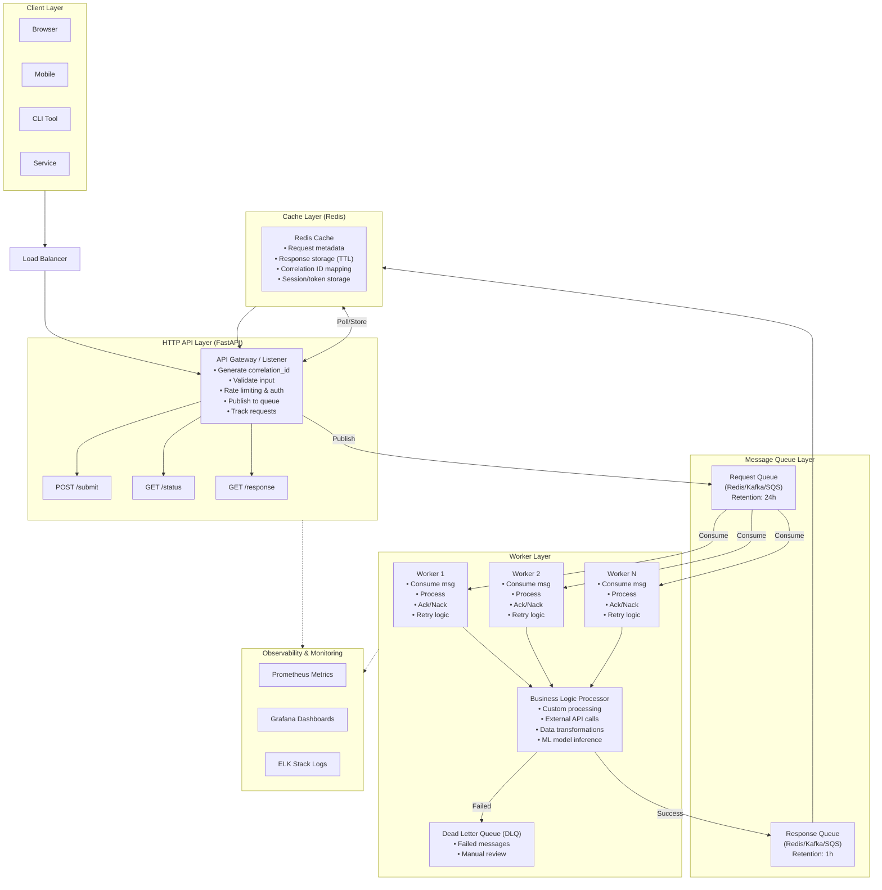
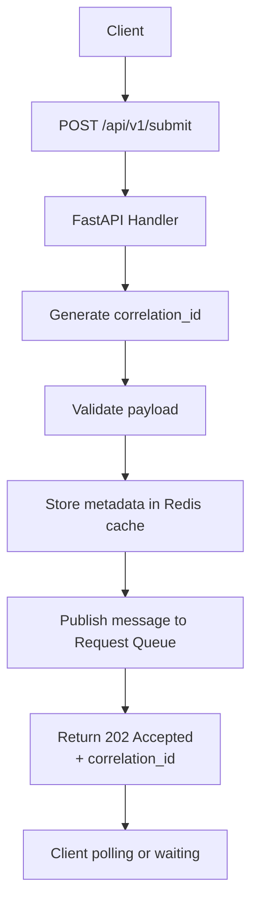
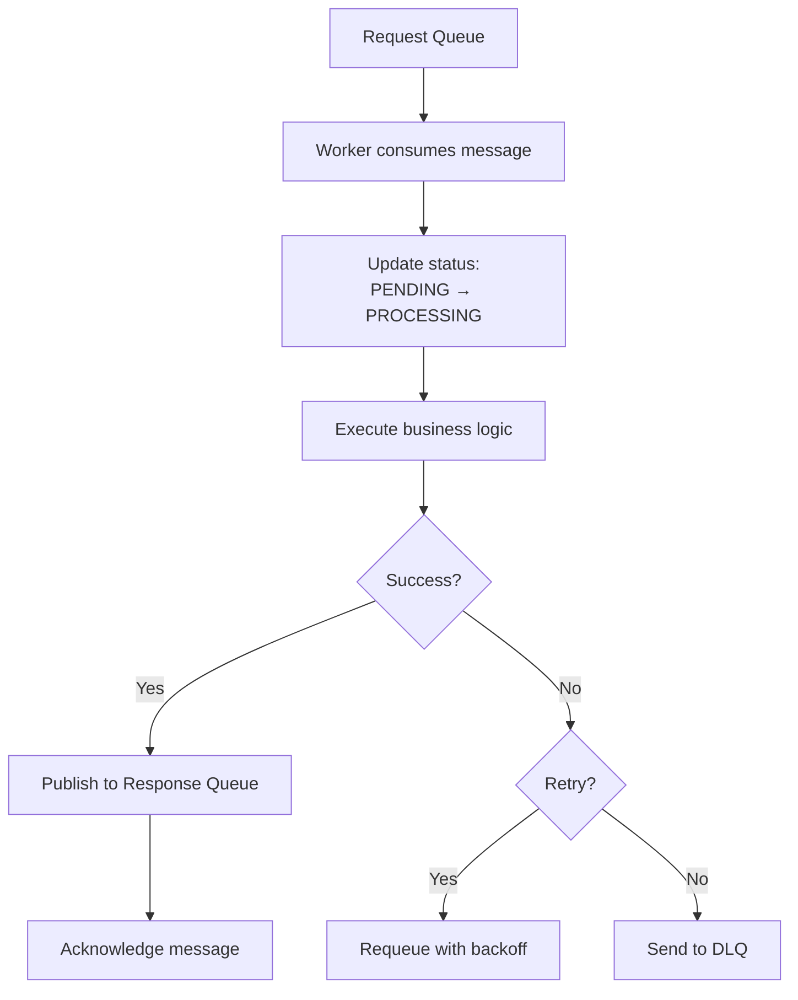
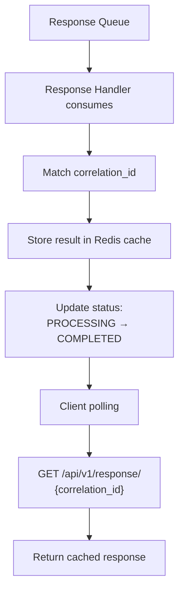

# OpenHQM Architecture

## Overview

OpenHQM implements an asynchronous request-response pattern using message queues to decouple HTTP request handling from backend processing. This architecture enables high scalability, fault tolerance, and efficient resource utilization.

## System Architecture Diagram



## Data Flow

### 1. Request Submission Flow



### 2. Worker Processing Flow



### 3. Response Delivery Flow



## Component Details

### HTTP API Layer

**Responsibilities:**
- Request ingestion and validation
- Correlation ID generation (UUID v4)
- Response retrieval and status checking
- Authentication and rate limiting
- Health checks and metrics exposition

**Technology:**
- FastAPI for async HTTP handling
- Pydantic for data validation
- Uvicorn as ASGI server
- JWT/API key authentication

**Scaling:**
- Stateless design allows horizontal scaling
- Multiple instances behind load balancer
- Shared Redis cache for state

### Message Queue Layer

**Supported Backends:**

#### Redis Streams
- **Pros:** Low latency, simple setup, built-in consumer groups
- **Cons:** Not suitable for huge message volumes
- **Use case:** Development, small to medium deployments

#### Apache Kafka
- **Pros:** High throughput, durability, partition-based scaling
- **Cons:** Complex setup, resource intensive
- **Use case:** Production, high-volume scenarios

#### AWS SQS
- **Pros:** Managed service, high availability, no infrastructure
- **Cons:** Eventual consistency, higher latency
- **Use case:** AWS-native deployments

**Queue Configuration:**
```yaml
Request Queue:
  - Name: "openhqm-requests"
  - Retention: 24 hours
  - Max retries: 3
  - Visibility timeout: 300s

Response Queue:
  - Name: "openhqm-responses"
  - Retention: 1 hour
  - TTL: Automatic cleanup
```

### Worker Layer

**Architecture:**
- Worker pool with configurable concurrency
- Consumer group for load distribution
- Graceful shutdown handling
- Health checks for worker liveness

**Processing Model:**
```python
async def worker_loop():
    while running:
        message = await queue.consume()
        try:
            result = await process_message(message)
            await queue.publish_response(result)
            await queue.acknowledge(message)
        except RetryableError:
            await queue.requeue(message)
        except FatalError:
            await queue.send_to_dlq(message)
```

**Scaling:**
- Scale workers independently of API layer
- Auto-scaling based on queue depth
- Multi-threaded or multi-process workers

### Cache Layer

**Purpose:**
- Store request metadata and status
- Cache responses with TTL
- Session management
- Rate limiting state

**Redis Data Structures:**
```
Key Pattern                          Type        TTL      Purpose
─────────────────────────────────────────────────────────────────────
req:{correlation_id}:meta           Hash        1h       Request metadata
req:{correlation_id}:status         String      1h       Current status
resp:{correlation_id}               Hash        1h       Response data
ratelimit:{client_id}               String      1m       Rate limit counter
```

## Message Formats

### Request Message
```json
{
  "correlation_id": "550e8400-e29b-41d4-a716-446655440000",
  "timestamp": "2026-02-07T10:30:00.000Z",
  "payload": {
    "operation": "process_data",
    "data": {
      "key": "value"
    }
  },
  "metadata": {
    "retry_count": 0,
    "priority": "normal",
    "timeout": 300,
    "client_id": "client-123"
  }
}
```

### Response Message
```json
{
  "correlation_id": "550e8400-e29b-41d4-a716-446655440000",
  "timestamp": "2026-02-07T10:30:05.000Z",
  "status": "COMPLETED",
  "result": {
    "output": "processed result",
    "metrics": {
      "processing_time_ms": 1250
    }
  },
  "error": null
}
```

## Failure Handling

### Retry Strategy

**Exponential Backoff:**
```
Attempt 1: Immediate
Attempt 2: 1 second
Attempt 3: 2 seconds
Attempt 4: 4 seconds
Max attempts: 3
```

**Retry Conditions:**
- Network errors
- Temporary service unavailability
- Rate limiting (429)
- Timeout errors

**Non-Retryable:**
- Validation errors (400)
- Authentication errors (401, 403)
- Not found (404)
- Client errors (4xx)

### Dead Letter Queue

Messages moved to DLQ after:
- Max retries exceeded
- Fatal processing errors
- Poison messages

**DLQ Processing:**
- Manual inspection
- Alert triggers
- Reprocessing tools

## Scalability Patterns

### Horizontal Scaling

**API Layer:**
```
Client requests
     ↓
Load Balancer (Round-robin)
     ├─→ API Instance 1
     ├─→ API Instance 2
     └─→ API Instance N
```

**Worker Layer:**
```
Request Queue (Partitioned)
     ├─→ Worker Group 1 (Partition 0)
     ├─→ Worker Group 2 (Partition 1)
     └─→ Worker Group N (Partition N)
```

### Performance Optimization

1. **Connection Pooling:**
   - Redis connection pool
   - HTTP client connection reuse
   - Queue consumer pools

2. **Batch Processing:**
   - Consume multiple messages per worker iteration
   - Batch database operations
   - Bulk cache updates

3. **Async Processing:**
   - Non-blocking I/O throughout
   - Async HTTP clients
   - Async queue operations

## Security Architecture

### Authentication
- API key authentication
- JWT tokens for session management
- Client certificate support

### Authorization
- Role-based access control (RBAC)
- Per-client rate limiting
- Resource quotas

### Data Security
- TLS/SSL for all HTTP traffic
- Message encryption in transit
- Sensitive data redaction in logs

### Network Security
```
Internet
    ↓
  [WAF]
    ↓
[Load Balancer]
    ↓
[API Layer] ←→ [Private Network] ←→ [Worker Layer]
    ↓                                      ↓
[Redis/Queue] (Private Subnet)    [Processing Resources]
```

## Monitoring & Observability

### Metrics

**API Metrics:**
- `http_requests_total`: Total requests by endpoint, status
- `http_request_duration_seconds`: Request latency histogram
- `http_requests_in_flight`: Current active requests

**Queue Metrics:**
- `queue_depth`: Messages waiting in queue
- `queue_publish_total`: Total messages published
- `queue_consume_total`: Total messages consumed
- `queue_dlq_total`: Messages sent to DLQ

**Worker Metrics:**
- `worker_active`: Active worker count
- `worker_processing_duration_seconds`: Processing time
- `worker_errors_total`: Processing errors by type

### Logging

**Structured Logs:**
```json
{
  "timestamp": "2026-02-07T10:30:00.123Z",
  "level": "INFO",
  "correlation_id": "550e8400-e29b-41d4-a716-446655440000",
  "component": "worker",
  "message": "Request processed successfully",
  "duration_ms": 1250,
  "worker_id": "worker-3"
}
```

### Tracing

**OpenTelemetry Integration:**
- Distributed tracing across components
- Span context propagation via correlation ID
- Trace sampling for performance

## Deployment Patterns

### Container Orchestration (Kubernetes)

```yaml
Namespace: openhqm
├── Deployment: openhqm-api (replicas: 3)
├── Deployment: openhqm-worker (replicas: 5)
├── StatefulSet: redis (replicas: 1 or cluster)
├── Service: openhqm-api-service (LoadBalancer)
├── Service: redis-service (ClusterIP)
├── ConfigMap: openhqm-config
└── Secret: openhqm-secrets
```

### High Availability

**API Layer:**
- Multiple replicas across availability zones
- Health checks with automatic restart
- Rolling updates with zero downtime

**Queue Layer:**
- Redis Sentinel for failover
- Kafka replication factor: 3
- SQS: Managed high availability

**Worker Layer:**
- Stateless workers for easy scaling
- Pod disruption budgets
- Automatic pod rescheduling

## Future Architecture Enhancements

1. **Event Sourcing:** Store all state changes as events
2. **CQRS:** Separate read and write models
3. **GraphQL API:** Alternative to REST
4. **gRPC Support:** For service-to-service communication
5. **Multi-Region:** Global distribution with data replication
6. **Service Mesh:** Istio for advanced traffic management
7. **Serverless Workers:** Lambda/Cloud Functions for elastic scaling

---

**Document Version:** 1.0  
**Last Updated:** February 7, 2026  
**Author:** OpenHQM Team
