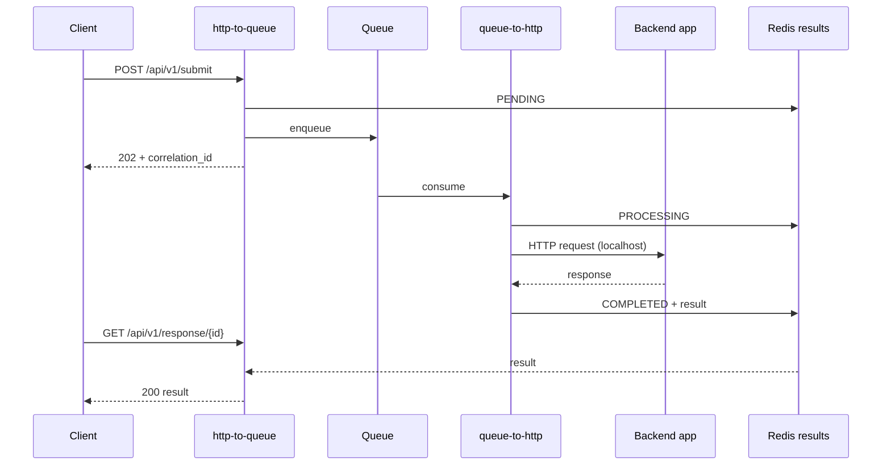

# Deployment

OpenHQM runs as a sidecar in two modes. They are independent processes that
communicate only through the queue + a shared Redis (for poll results).

| Mode | Command | Role |
| --- | --- | --- |
| **http-to-queue** | `python -m openhqm http-to-queue` | Accept HTTP, enqueue, serve poll results |
| **queue-to-http** | `python -m openhqm queue-to-http` | Consume queue, forward to the backend over HTTP |

Both ship in the same image; the mode is the argument.

## Request lifecycle



On failure the worker retries with exponential backoff up to
`OPENHQM_WORKER__MAX_RETRIES`, then publishes the message to the DLQ and marks
the request `FAILED` (pollers see the error).

## Kubernetes Gateway pattern

OpenHQM sits *behind* your Gateway — the Gateway (Istio / Envoy Gateway /
Contour / any Gateway API implementation) does the routing; OpenHQM adds the
async queue hop. A complete manifest is in
[`examples/kubernetes/gateway.yaml`](../examples/kubernetes/gateway.yaml):

- an `http-to-queue` Deployment + Service, fronted by an `HTTPRoute`;
- your app Deployment with a `queue-to-http` sidecar that forwards to `localhost`.

```bash
kubectl apply -f examples/kubernetes/gateway.yaml
```

Per-backend images keep the sidecar small: `openhqm:latest-redis`,
`-kafka`, `-sqs`, `-azure`, `-gcp`, `-mqtt`, or `-minimal` (custom handlers
only). Build them with `docker build --build-arg QUEUE_BACKEND=<name> .`.

## Health probes

| Path | Use | Behavior |
| --- | --- | --- |
| `/health` | liveness | 200 while the process is up (`degraded` if a dependency is down, still 200) |
| `/ready` | readiness | 200 when queue **and** cache are reachable, else 503 |

## Graceful shutdown

A request's lifecycle in the result store
(`PENDING → PROCESSING → COMPLETED/FAILED`, TTL'd) is tracked by correlation ID.

- **http-to-queue**: uvicorn drains in-flight HTTP requests on `SIGTERM`, then
  closes the queue and cache. Set `terminationGracePeriodSeconds` ≥ your slowest
  request.
- **queue-to-http**: on `SIGTERM` the worker stops pulling new messages, lets the
  in-flight message finish, then disconnects. A message interrupted mid-flight is
  not acked and is redelivered (at-least-once).

## Configuration

All configuration is environment variables (prefix `OPENHQM_`, `__` for nesting).
See [`.env.example`](../.env.example) for the full list and
[QUEUE_BACKENDS.md](QUEUE_BACKENDS.md) for per-backend settings.
