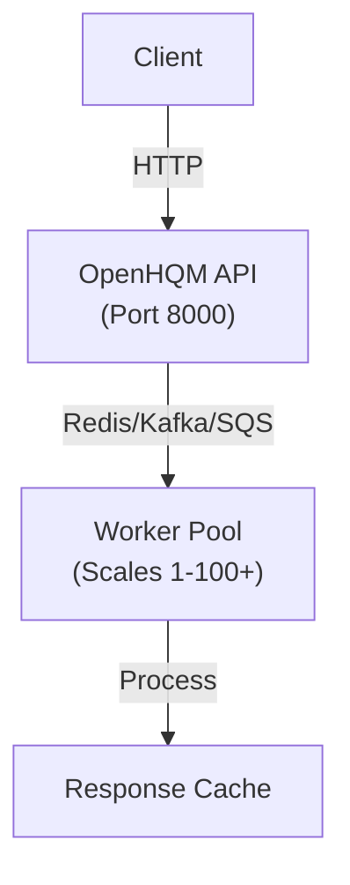
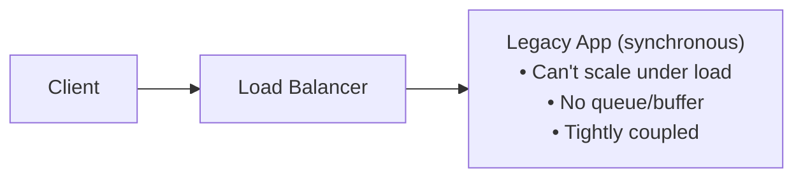
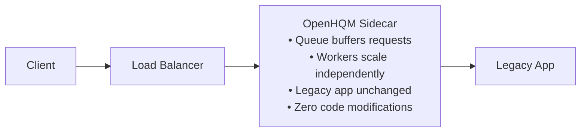
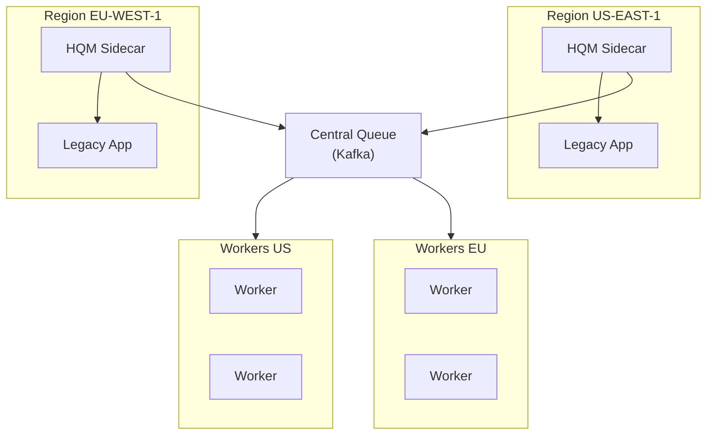
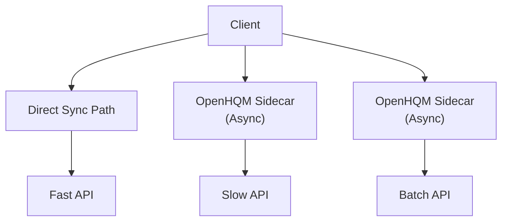
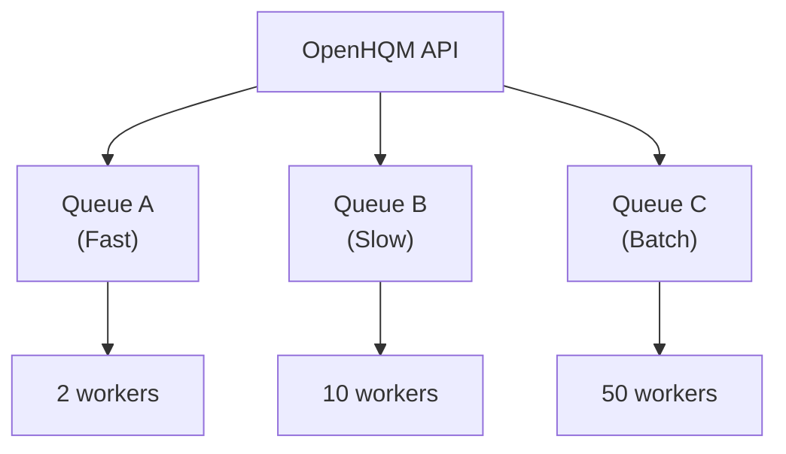

# OpenHQM Deployment Patterns

## Pattern 1: Standalone Async Queue

Traditional message queue pattern for microservices.



## Pattern 2: Kubernetes Sidecar (Envoy-Style)

**The Game Changer for Legacy Apps!**

```
┌────────────────────────────────────────────────┐
│                Pod (same network)              │
│                                                │
│  ┌──────────────┐         ┌─────────────────┐ │
│  │  OpenHQM     │   HTTP  │  Legacy App     │ │
│  │  Sidecar     │────────>│  (unchanged)    │ │
│  │  :8000       │         │  :8080          │ │
│  └──────┬───────┘         └─────────────────┘ │
│         │                                      │
└─────────┼──────────────────────────────────────┘
          │
          │ Queue
          ▼
┌─────────────────────────────────────────────────┐
│          Worker Deployment                      │
│  (Scales independently from app pods)           │
│                                                 │
│  ┌──────┐  ┌──────┐  ┌──────┐  ┌──────┐       │
│  │Worker│  │Worker│  │Worker│  │Worker│ ...   │
│  └───┬──┘  └───┬──┘  └───┬──┘  └───┬──┘       │
│      └──────────┴─────────┴─────────┘          │
│                   │                             │
└───────────────────┼─────────────────────────────┘
                    │
                    │ HTTP
                    ▼
         ┌────────────────────┐
         │  Legacy App Service│
         │  (ClusterIP)       │
         └────────────────────┘
```

### Why This is Powerful

**Before OpenHQM:**



**After OpenHQM (Sidecar):**



## Pattern 3: Multi-Region with Sidecar



## Pattern 4: Hybrid (Some Async, Some Sync)



**Use Case:** Keep critical low-latency paths synchronous, queue heavy operations.

## Scaling Patterns

### Auto-Scaling Based on Queue Depth

```
Queue Depth: 0-100 msgs     → 2 workers
Queue Depth: 100-500 msgs   → 10 workers
Queue Depth: 500-1000 msgs  → 25 workers
Queue Depth: 1000+ msgs     → 50 workers
```

### Time-Based Scaling

```
Off-Peak (2am-6am):   Scale to 0 workers (save costs)
Normal (6am-6pm):     5-20 workers
Peak (6pm-9pm):       20-50 workers
```

### Per-Endpoint Scaling



## Migration Path

### Step 1: Deploy Sidecar (No Traffic)
```
[Legacy App] ← Direct Traffic (100%)
[OpenHQM Sidecar] ← No Traffic (0%)
```

### Step 2: Canary (10% Traffic)
```
[Legacy App] ← Direct Traffic (90%)
[OpenHQM Sidecar] ← Test Traffic (10%)
```

### Step 3: Gradual Rollout
```
Week 1: 25% → OpenHQM
Week 2: 50% → OpenHQM
Week 3: 75% → OpenHQM
Week 4: 100% → OpenHQM
```

### Step 4: Optimize
```
[OpenHQM Sidecar] ← All Traffic (100%)
[Workers] ← Auto-scaled based on queue
[Legacy App] ← Protected by queue
```

## Real-World Examples

### Example 1: E-Commerce Order Processing

**Before:**
- Synchronous order processing
- Spikes during sales crash site
- Can't scale fast enough

**After with OpenHQM:**
```
Customer → OpenHQM Sidecar → Order Queue
                                  │
                                  ├→ Worker Pool (scales 10-100)
                                  │
                                  └→ Legacy Order System (protected)
```

### Example 2: Report Generation

**Before:**
- User requests report
- Waits 30-60 seconds
- Timeout issues

**After with OpenHQM:**
```
User → OpenHQM → Queue → Worker → Generate PDF
  │                                      │
  └─ Returns: "Report ID: 12345"        │
                                         │
Later: GET /response/12345 ─────────────┘
```

### Example 3: Legacy SOAP/XML Service

**Before:**
- Old SOAP service
- Can't handle modern load
- Can't modify (vendor app)

**After with OpenHQM:**
```
Modern API → OpenHQM Sidecar → Queue → Workers
                                         │
                                         └→ SOAP Service (unchanged)
```

## Performance Characteristics

### Latency Profile

```
Sync Path (Direct):
├─ P50: 50ms
├─ P95: 200ms
└─ P99: 500ms

Async Path (OpenHQM):
├─ Submit P50: 5ms (queue publish)
├─ Submit P95: 15ms
└─ Total E2E: Depends on worker processing
```

### Throughput

```
Without OpenHQM:
├─ Max: 100 req/s (legacy app limit)
└─ Crashes at 150 req/s

With OpenHQM:
├─ Ingest: 10,000 req/s (queue)
├─ Process: 100 req/s (legacy app)
└─ Queue buffers the difference
```

## Cost Model

### Traditional Scaling
```
1 App Instance: $100/month
10 App Instances (for spikes): $1,000/month
Avg Utilization: 20%
Wasted Cost: $800/month
```

### OpenHQM Sidecar Pattern
```
3 App Instances (steady): $300/month
OpenHQM Sidecars: $30/month (lightweight)
Workers (auto-scale): $200/month (avg)
Total: $530/month
Savings: $470/month (47%)
```

## When to Use Each Pattern

### Use Sidecar Pattern When:
- ✅ Legacy app can't be modified
- ✅ Need to decouple scaling
- ✅ Traffic has spikes
- ✅ Want zero-downtime migration
- ✅ App is HTTP-based

### Use Standalone When:
- ✅ Building new microservices
- ✅ Need distributed queue
- ✅ Multiple independent services
- ✅ Complex routing logic

### Use Direct (No Queue) When:
- ✅ Sub-10ms latency required
- ✅ Simple CRUD operations
- ✅ No scaling issues
- ✅ Low traffic volume

## Summary

OpenHQM transforms from a standalone async queue into a **Kubernetes-native sidecar proxy** that:

1. **Modernizes legacy apps** without code changes
2. **Decouples scaling** of ingress, workers, and application
3. **Protects backends** from traffic spikes via queue buffering
4. **Enables gradual migration** to async patterns
5. **Reduces costs** through efficient scaling

**The sidecar pattern makes OpenHQM an infrastructure-level solution for adding async capabilities to any HTTP service.**
