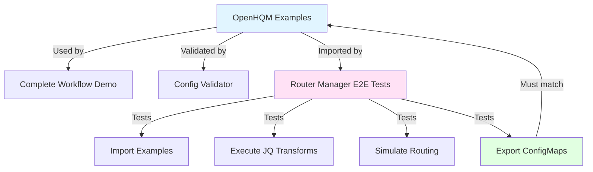

# OpenHQM ↔️ OpenHQM Router Manager Integration

This document describes the integration and validation between the OpenHQM and OpenHQM Router Manager projects.

## 🔗 Project Relationship

```
┌─────────────────────────────────────────────────────────────┐
│                     OpenHQM Ecosystem                       │
├─────────────────────────────────────────────────────────────┤
│                                                             │
│  ┌─────────────────┐         ┌──────────────────────────┐  │
│  │    OpenHQM      │◄────────┤  OpenHQM Router Manager  │  │
│  │  (Backend/API)  │         │     (Web UI/Tool)        │  │
│  └─────────────────┘         └──────────────────────────┘  │
│         │                              │                    │
│         │ Examples                     │ Tests              │
│         │ (source of truth)            │ (validation)       │
│         ▼                              ▼                    │
│  ┌──────────────────────────────────────────────────────┐  │
│  │         Routing Configuration Format v1.0            │  │
│  │  • YAML structure                                    │  │
│  │  • JQ transformations                               │  │
│  │  • Kubernetes ConfigMaps                            │  │
│  │  • Match patterns and priorities                    │  │
│  └──────────────────────────────────────────────────────┘  │
│                                                             │
└─────────────────────────────────────────────────────────────┘
```

## 📝 Integration Points

### 1. Example Configurations (Source of Truth)

**Location:** `openhqm/examples/`

- **`routing-config.yaml`** - Comprehensive routing configuration with all features
- **`k8s-routing-configmap.yaml`** - Kubernetes deployment format
- **`complete_workflow_example.py`** - Executable demo of all scenarios
- **`validate_routing_config.py`** - Configuration validator

**Purpose:**
- Define the canonical routing configuration format
- Provide production-ready examples
- Serve as test data for Router Manager
- Document best practices

### 2. Router Manager E2E Tests (Validation)

**Location:** `openhqm-rm/e2e/`

- **`openhqm-examples.spec.ts`** - Validates OpenHQM examples work in Router Manager
- **`fixtures.ts`** - Contains OpenHQM example data as test fixtures
- Tests import/export, transformations, and compatibility

**Purpose:**
- Ensure Router Manager can handle OpenHQM configurations
- Validate JQ expressions execute correctly
- Test ConfigMap import/export compatibility
- Maintain contract between projects

### 3. Test Fixtures (Shared Data)

**Location:** `openhqm-rm/e2e/fixtures.ts`

Fixtures include:
- `OPENHQM_ROUTING_CONFIG` - Full routing configuration
- `OPENHQM_SAMPLE_PAYLOADS` - Test payloads for each route
- `OPENHQM_EXPECTED_OUTPUTS` - Expected transformation results
- `OPENHQM_CONFIGMAP_TEMPLATE` - Kubernetes ConfigMap structure

**Purpose:**
- Share example data between projects
- Ensure consistent test data
- Document expected formats

## ✅ Validation Flow



## 🧪 Testing Strategy

### OpenHQM Tests
```bash
cd openhqm

# Run unit tests
pytest tests/test_routing.py -v

# Validate examples
python3 examples/validate_routing_config.py examples/routing-config.yaml

# Run complete workflow demo
python3 examples/complete_workflow_example.py
```

### Router Manager Tests
```bash
cd openhqm-rm

# Run E2E tests including OpenHQM examples
npm run test:e2e

# Run only OpenHQM example validation
npx playwright test openhqm-examples

# Run with UI to see tests in action
npm run test:e2e:ui
```

## 📋 Compatibility Matrix

| OpenHQM Feature | Example Config | Router Manager Support | E2E Test |
|----------------|----------------|----------------------|----------|
| JQ Transformations | ✅ routing-config.yaml | ✅ JQ Editor | ✅ openhqm-examples.spec.ts |
| Template Transformations | ✅ routing-config.yaml | ✅ Template Editor | ✅ openhqm-examples.spec.ts |
| JSONPath Transformations | ✅ routing-config.yaml | ✅ JSONPath Editor | ✅ openhqm-examples.spec.ts |
| Regex Pattern Matching | ✅ routing-config.yaml | ✅ Pattern Editor | ✅ openhqm-examples.spec.ts |
| Header Mappings | ✅ routing-config.yaml | ✅ Header Config | ✅ openhqm-examples.spec.ts |
| Query Parameters | ✅ routing-config.yaml | ✅ Query Config | ✅ openhqm-examples.spec.ts |
| Priority Ordering | ✅ routing-config.yaml | ✅ Priority UI | ✅ openhqm-examples.spec.ts |
| Default Routes | ✅ routing-config.yaml | ✅ Default Config | ✅ openhqm-examples.spec.ts |
| ConfigMap Export | ✅ k8s-routing-configmap.yaml | ✅ Export Feature | ✅ configmap-management.spec.ts |
| ConfigMap Import | ✅ k8s-routing-configmap.yaml | ✅ Import Feature | ✅ configmap-management.spec.ts |

## 🔄 Development Workflow

### When Updating OpenHQM Examples

1. **Update example configuration:**
   ```bash
   cd openhqm/examples
   vim routing-config.yaml  # Update configuration
   ```

2. **Validate changes:**
   ```bash
   python3 validate_routing_config.py routing-config.yaml
   ```

3. **Test with complete workflow:**
   ```bash
   # Start OpenHQM
   OPENHQM_ROUTING__ENABLED=true \
   OPENHQM_ROUTING__CONFIG_PATH=examples/routing-config.yaml \
   python3 -m openhqm.api.listener &

   # Run workflow
   python3 examples/complete_workflow_example.py
   ```

4. **Verify Router Manager compatibility:**
   ```bash
   cd ../openhqm-rm
   npm run test:e2e -- openhqm-examples.spec.ts
   ```

5. **If tests fail:**
   - Update Router Manager to support new features
   - Update fixtures in `openhqm-rm/e2e/fixtures.ts`
   - Update E2E tests in `openhqm-rm/e2e/openhqm-examples.spec.ts`

### When Updating Router Manager

1. **Make Router Manager changes:**
   ```bash
   cd openhqm-rm
   # Implement new features
   ```

2. **Update E2E tests:**
   ```bash
   # Add tests for new features
   vim e2e/route-management.spec.ts
   ```

3. **Verify OpenHQM compatibility:**
   ```bash
   npm run test:e2e -- openhqm-examples.spec.ts
   ```

4. **If examples don't work:**
   - Fix Router Manager implementation
   - OR update OpenHQM examples if format changed
   - Update fixtures to match

## 📚 Cross-References

### From OpenHQM Examples → Router Manager

**In `openhqm/examples/README.md`:**
```markdown
## 🔗 Related Tools

**[OpenHQM Router Manager](../../openhqm-rm/)** - Visual web UI for creating and testing routing rules
- Import these examples directly into the Router Manager
- Test transformations in the JQ Playground
- Simulate routing with sample payloads
- Export validated ConfigMaps back to OpenHQM
```

### From Router Manager → OpenHQM Examples

**In `openhqm-rm/e2e/README.md`:**
```markdown
### Testing Against OpenHQM Examples

The `openhqm-examples.spec.ts` test suite validates that Router Manager correctly handles
all example configurations from the OpenHQM project.

These tests ensure compatibility between openhqm and openhqm-rm:
- Changes to OpenHQM examples trigger Router Manager tests
- Router Manager changes are validated against OpenHQM examples
- Both projects must maintain compatible formats
```

## 🚀 Continuous Integration

### Recommended CI/CD Pipeline

```yaml
# Example GitHub Actions workflow
name: Cross-Project Validation

on:
  push:
    paths:
      - 'openhqm/examples/**'
      - 'openhqm-rm/e2e/**'

jobs:
  validate-integration:
    runs-on: ubuntu-latest
    steps:
      # Test OpenHQM examples
      - name: Validate OpenHQM Examples
        run: |
          cd openhqm/examples
          python3 validate_routing_config.py routing-config.yaml

      # Test Router Manager with OpenHQM examples
      - name: Router Manager E2E Tests
        run: |
          cd openhqm-rm
          npm run test:e2e -- openhqm-examples.spec.ts
```

## ✨ Benefits of This Integration

1. **Single Source of Truth:** OpenHQM examples define the canonical format
2. **Automatic Validation:** Router Manager tests validate examples work
3. **Living Documentation:** Examples are always tested and up-to-date
4. **Contract Testing:** Both projects maintain compatibility
5. **Developer Confidence:** Changes in one project don't break the other
6. **Better UX:** Users can trust examples work in both tools

## 📖 User Journey

A typical user workflow leveraging both projects:

1. **Learn:** Read OpenHQM examples to understand capabilities
2. **Design:** Use Router Manager to create and test routes visually
3. **Validate:** Run validator script on exported configuration
4. **Deploy:** Export ConfigMap and deploy to Kubernetes
5. **Test:** Run complete workflow example to verify production config
6. **Monitor:** Use OpenHQM metrics and logs in production

## 🔧 Maintenance

### Regular Checks

- [ ] Run `validate_routing_config.py` on all examples
- [ ] Run `complete_workflow_example.py` to test end-to-end
- [ ] Run Router Manager E2E tests with OpenHQM examples
- [ ] Update fixtures when examples change
- [ ] Keep documentation synchronized
- [ ] Test import/export round-trips

### Version Compatibility

Both projects use version `1.0` of the routing configuration format.

When the format changes:
1. Update version in both projects
2. Update examples in OpenHQM
3. Update Router Manager to support new version
4. Update E2E tests and fixtures
5. Document migration path for users

## 📞 Support

For issues related to:
- **OpenHQM examples:** File issue in `openhqm` repository
- **Router Manager compatibility:** File issue in `openhqm-rm` repository
- **Integration problems:** File issues in both repos with links

---

**Last Updated:** 2024-02-08  
**Format Version:** 1.0  
**Status:** ✅ Validated and Tested
