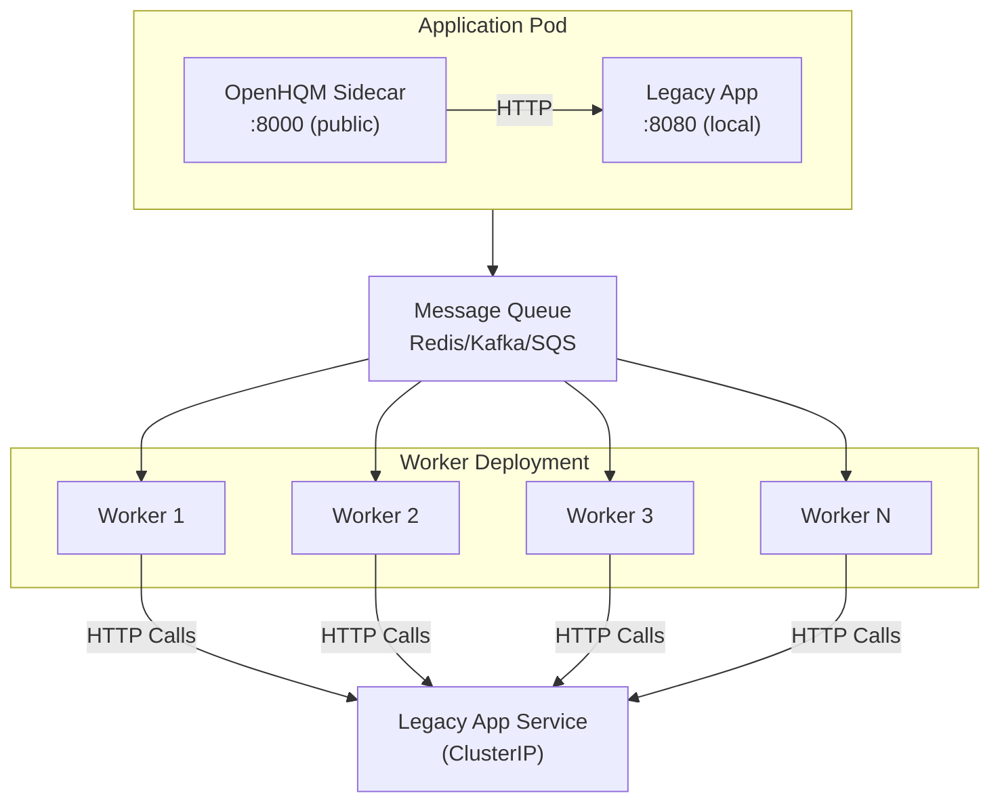

# OpenHQM as Kubernetes Sidecar/Envoy Pattern

## Overview

Deploy OpenHQM as a **sidecar container** alongside legacy HTTP-only applications to add queue-based async processing capabilities without modifying application code. This pattern enables horizontal scaling, load shedding, and gradual modernization.

## Architecture Pattern



## Key Benefits

1. **Zero Code Changes**: Legacy application code remains unchanged
2. **Independent Scaling**: Scale API ingress, workers, and legacy app separately
3. **Load Shedding**: Queue absorbs traffic spikes, protecting legacy backend
4. **Observability**: Add metrics/logging without instrumenting legacy code
5. **Gradual Migration**: Modernize incrementally without big-bang rewrites
6. **Cost Optimization**: Scale workers to zero during off-peak hours

## Use Cases

### 1. Legacy REST API Modernization
Add async capabilities to synchronous REST endpoints without code changes.

### 2. Batch Processing
Convert synchronous batch operations to queued background jobs.

### 3. Rate Limiting
Protect legacy backends from traffic spikes using queue-based throttling.

### 4. Multi-Region Deployment
Central queue with workers in multiple regions calling regional legacy services.

### 5. A/B Testing
Route some traffic through queue while keeping critical paths synchronous.

## Deployment Configurations

### Basic Sidecar Configuration

```yaml
apiVersion: apps/v1
kind: Deployment
metadata:
  name: legacy-app-async
  namespace: production
spec:
  replicas: 3
  selector:
    matchLabels:
      app: legacy-app
  template:
    metadata:
      labels:
        app: legacy-app
        version: v1
    spec:
      containers:
      # OpenHQM Sidecar - Handles async queue ingress
      - name: openhqm-sidecar
        image: ghcr.io/yourorg/openhqm:latest
        imagePullPolicy: IfNotPresent
        command: ["python", "-m", "openhqm.api.listener"]
        ports:
        - containerPort: 8000
          name: http
          protocol: TCP
        env:
        # Proxy mode - forward to localhost legacy app
        - name: OPENHQM_PROXY__ENABLED
          value: "true"
        - name: OPENHQM_PROXY__DEFAULT_ENDPOINT
          value: "http://localhost:8080"
        
        # Queue configuration
        - name: OPENHQM_QUEUE__TYPE
          value: "redis"
        - name: OPENHQM_QUEUE__REDIS_URL
          valueFrom:
            secretKeyRef:
              name: redis-credentials
              key: connection-string
        
        # Cache configuration
        - name: OPENHQM_CACHE__TYPE
          value: "redis"
        - name: OPENHQM_CACHE__REDIS_URL
          valueFrom:
            secretKeyRef:
              name: redis-credentials
              key: connection-string
        
        # Monitoring
        - name: OPENHQM_MONITORING__LOG_LEVEL
          value: "INFO"
        - name: OPENHQM_MONITORING__METRICS_ENABLED
          value: "true"
        
        resources:
          requests:
            cpu: 100m
            memory: 128Mi
          limits:
            cpu: 500m
            memory: 512Mi
        
        livenessProbe:
          httpGet:
            path: /health
            port: 8000
          initialDelaySeconds: 10
          periodSeconds: 30
        
        readinessProbe:
          httpGet:
            path: /health
            port: 8000
          initialDelaySeconds: 5
          periodSeconds: 10
      
      # Legacy Application - Unchanged
      - name: legacy-app
        image: your-legacy-app:v1.0
        imagePullPolicy: IfNotPresent
        ports:
        - containerPort: 8080
          name: app
          protocol: TCP
        env:
        - name: APP_ENV
          value: "production"
        - name: DB_CONNECTION
          valueFrom:
            secretKeyRef:
              name: db-credentials
              key: connection-string
        resources:
          requests:
            cpu: 500m
            memory: 1Gi
          limits:
            cpu: 2000m
            memory: 4Gi
        
        livenessProbe:
          httpGet:
            path: /healthz
            port: 8080
          initialDelaySeconds: 30
          periodSeconds: 30
        
        readinessProbe:
          httpGet:
            path: /ready
            port: 8080
          initialDelaySeconds: 10
          periodSeconds: 10

---
# Service - Exposes sidecar publicly, not legacy app directly
apiVersion: v1
kind: Service
metadata:
  name: legacy-app-service
  namespace: production
spec:
  selector:
    app: legacy-app
  ports:
  - name: http
    port: 80
    targetPort: 8000  # OpenHQM sidecar, not legacy app
    protocol: TCP
  type: ClusterIP

---
# Worker Deployment - Scales independently
apiVersion: apps/v1
kind: Deployment
metadata:
  name: openhqm-workers
  namespace: production
spec:
  replicas: 10  # Scale based on queue depth
  selector:
    matchLabels:
      app: openhqm-worker
  template:
    metadata:
      labels:
        app: openhqm-worker
        version: v1
    spec:
      containers:
      - name: worker
        image: ghcr.io/yourorg/openhqm:latest
        imagePullPolicy: IfNotPresent
        command: ["python", "-m", "openhqm.worker.worker", "$(POD_NAME)"]
        env:
        - name: POD_NAME
          valueFrom:
            fieldRef:
              fieldPath: metadata.name
        
        # Proxy mode - call legacy app service
        - name: OPENHQM_PROXY__ENABLED
          value: "true"
        - name: OPENHQM_PROXY__DEFAULT_ENDPOINT
          value: "http://legacy-app-internal:8080"  # Internal service
        
        # Queue configuration
        - name: OPENHQM_QUEUE__TYPE
          value: "redis"
        - name: OPENHQM_QUEUE__REDIS_URL
          valueFrom:
            secretKeyRef:
              name: redis-credentials
              key: connection-string
        
        # Cache configuration
        - name: OPENHQM_CACHE__TYPE
          value: "redis"
        - name: OPENHQM_CACHE__REDIS_URL
          valueFrom:
            secretKeyRef:
              name: redis-credentials
              key: connection-string
        
        # Worker configuration
        - name: OPENHQM_WORKER__BATCH_SIZE
          value: "10"
        - name: OPENHQM_WORKER__TIMEOUT_SECONDS
          value: "300"
        - name: OPENHQM_WORKER__MAX_RETRIES
          value: "3"
        
        # Monitoring
        - name: OPENHQM_MONITORING__LOG_LEVEL
          value: "INFO"
        
        resources:
          requests:
            cpu: 200m
            memory: 256Mi
          limits:
            cpu: 1000m
            memory: 1Gi

---
# Internal service for workers to call legacy app
apiVersion: v1
kind: Service
metadata:
  name: legacy-app-internal
  namespace: production
spec:
  selector:
    app: legacy-app
  ports:
  - name: app
    port: 8080
    targetPort: 8080  # Direct to legacy app, not sidecar
    protocol: TCP
  type: ClusterIP

---
# HorizontalPodAutoscaler for workers based on queue depth
apiVersion: autoscaling/v2
kind: HorizontalPodAutoscaler
metadata:
  name: openhqm-workers-hpa
  namespace: production
spec:
  scaleTargetRef:
    apiVersion: apps/v1
    kind: Deployment
    name: openhqm-workers
  minReplicas: 2
  maxReplicas: 50
  metrics:
  - type: External
    external:
      metric:
        name: redis_stream_length
        selector:
          matchLabels:
            stream: openhqm-requests
      target:
        type: AverageValue
        averageValue: "100"  # Scale up if queue > 100 messages per worker
  behavior:
    scaleUp:
      stabilizationWindowSeconds: 60
      policies:
      - type: Percent
        value: 100
        periodSeconds: 60
    scaleDown:
      stabilizationWindowSeconds: 300
      policies:
      - type: Percent
        value: 50
        periodSeconds: 60
```

## Advanced Configurations

### Multi-Endpoint Sidecar

```yaml
- name: openhqm-sidecar
  env:
  - name: OPENHQM_PROXY__ENABLED
    value: "true"
  - name: OPENHQM_PROXY__ENDPOINTS
    value: |
      {
        "api-v1": {
          "url": "http://localhost:8080/api/v1",
          "method": "POST",
          "timeout": 300
        },
        "api-v2": {
          "url": "http://localhost:8081/api/v2",
          "method": "POST",
          "timeout": 600
        },
        "batch": {
          "url": "http://localhost:8080/batch",
          "method": "POST",
          "timeout": 1800
        }
      }
```

### With Authentication

```yaml
- name: openhqm-sidecar
  env:
  - name: OPENHQM_PROXY__ENABLED
    value: "true"
  - name: OPENHQM_PROXY__ENDPOINTS
    value: |
      {
        "protected-api": {
          "url": "http://localhost:8080",
          "auth_type": "bearer",
          "auth_token": "$(LEGACY_APP_TOKEN)"
        }
      }
  - name: LEGACY_APP_TOKEN
    valueFrom:
      secretKeyRef:
        name: legacy-app-credentials
        key: api-token
```

### With Service Mesh (Istio)

```yaml
apiVersion: apps/v1
kind: Deployment
metadata:
  name: legacy-app-async
  annotations:
    sidecar.istio.io/inject: "true"
spec:
  template:
    metadata:
      annotations:
        # Allow OpenHQM sidecar to communicate with legacy app
        traffic.sidecar.istio.io/includeOutboundPorts: ""
        traffic.sidecar.istio.io/excludeInboundPorts: "8000,8080"
    spec:
      containers:
      - name: openhqm-sidecar
        # ... OpenHQM config
      - name: legacy-app
        # ... Legacy app config
```

## Monitoring & Observability

### Prometheus ServiceMonitor

```yaml
apiVersion: monitoring.coreos.com/v1
kind: ServiceMonitor
metadata:
  name: openhqm-sidecar
  namespace: production
spec:
  selector:
    matchLabels:
      app: legacy-app
  endpoints:
  - port: http
    path: /metrics
    interval: 30s
```

### Grafana Dashboard Queries

```promql
# Queue depth
redis_stream_length{stream="openhqm-requests"}

# Processing rate
rate(openhqm_worker_processing_duration_seconds_count[5m])

# Error rate
rate(openhqm_worker_errors_total[5m])

# Worker utilization
sum(rate(openhqm_worker_processing_duration_seconds_sum[5m])) 
  / 
sum(openhqm_worker_active)
```

## Migration Strategy

### Phase 1: Deploy Sidecar (No Traffic)
- Add OpenHQM sidecar to pod
- Keep existing service pointing to legacy app
- Test sidecar health

### Phase 2: Canary Traffic
- Create new service pointing to sidecar
- Route 10% traffic through sidecar
- Monitor metrics

### Phase 3: Gradual Rollout
- Increase traffic to 25%, 50%, 75%
- Monitor queue depth and latency
- Scale workers as needed

### Phase 4: Full Migration
- Route 100% traffic through sidecar
- Remove direct legacy app exposure
- Optimize worker scaling

### Phase 5: Optimization
- Tune worker count
- Adjust timeouts
- Configure HPA based on metrics

## Troubleshooting

### High Queue Depth
```bash
# Check queue length
kubectl exec -it redis-0 -- redis-cli XLEN openhqm-requests

# Scale workers manually
kubectl scale deployment openhqm-workers --replicas=20

# Check worker logs
kubectl logs -l app=openhqm-worker --tail=100
```

### Sidecar Not Forwarding
```bash
# Check sidecar logs
kubectl logs -l app=legacy-app -c openhqm-sidecar

# Test connectivity to legacy app
kubectl exec -it $(kubectl get pod -l app=legacy-app -o name | head -1) \
  -c openhqm-sidecar -- curl http://localhost:8080/healthz

# Check environment variables
kubectl exec -it $(kubectl get pod -l app=legacy-app -o name | head -1) \
  -c openhqm-sidecar -- env | grep OPENHQM
```

### Worker Connection Issues
```bash
# Check worker logs
kubectl logs -l app=openhqm-worker --tail=100

# Test connectivity to legacy service
kubectl run -it --rm debug --image=curlimages/curl --restart=Never \
  -- curl http://legacy-app-internal:8080/healthz

# Check DNS resolution
kubectl run -it --rm debug --image=busybox --restart=Never \
  -- nslookup legacy-app-internal
```

## Security Considerations

### Network Policies

```yaml
apiVersion: networking.k8s.io/v1
kind: NetworkPolicy
metadata:
  name: openhqm-sidecar-policy
spec:
  podSelector:
    matchLabels:
      app: legacy-app
  policyTypes:
  - Ingress
  - Egress
  ingress:
  - from:
    - podSelector:
        matchLabels:
          app: ingress-controller
    ports:
    - protocol: TCP
      port: 8000
  egress:
  - to:
    - podSelector:
        matchLabels:
          app: redis
    ports:
    - protocol: TCP
      port: 6379
```

### RBAC

```yaml
apiVersion: v1
kind: ServiceAccount
metadata:
  name: openhqm-worker
---
apiVersion: rbac.authorization.k8s.io/v1
kind: Role
metadata:
  name: openhqm-worker
rules:
- apiGroups: [""]
  resources: ["configmaps", "secrets"]
  verbs: ["get", "list", "watch"]
---
apiVersion: rbac.authorization.k8s.io/v1
kind: RoleBinding
metadata:
  name: openhqm-worker
roleRef:
  apiGroup: rbac.authorization.k8s.io
  kind: Role
  name: openhqm-worker
subjects:
- kind: ServiceAccount
  name: openhqm-worker
```

## Best Practices

1. **Resource Limits**: Set appropriate CPU/memory limits
2. **Health Checks**: Configure liveness/readiness probes
3. **Graceful Shutdown**: Use `terminationGracePeriodSeconds`
4. **Autoscaling**: Use HPA based on queue depth
5. **Monitoring**: Export metrics to Prometheus
6. **Logging**: Use structured logging with correlation IDs
7. **Security**: Use NetworkPolicies and RBAC
8. **Testing**: Test sidecar in staging before production
9. **Rollback**: Keep direct legacy app service as backup
10. **Documentation**: Document which endpoints are async

## Cost Optimization

- **Scale to Zero**: Use Keda for scaling workers to zero during off-peak
- **Spot Instances**: Run workers on spot/preemptible instances
- **Right-sizing**: Monitor actual resource usage and adjust requests/limits
- **Queue TTL**: Set message TTL to prevent unbounded queue growth
- **Batch Processing**: Increase worker batch_size to reduce overhead

## See Also

- [PROXY_MODE.md](PROXY_MODE.md) - Complete proxy configuration guide
- [ARCHITECTURE.md](ARCHITECTURE.md) - System architecture details
- [SDD.md](SDD.md) - Software design document
