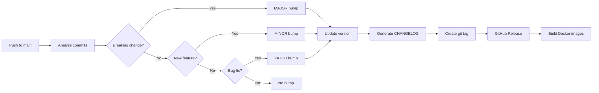

# Semantic Release Configuration

This document explains the semantic versioning setup for OpenHQM.

## Overview

OpenHQM uses [Python Semantic Release](https://python-semantic-release.readthedocs.io/) to automate:
- Version bumping based on commit messages
- CHANGELOG.md generation
- Git tag creation
- GitHub release creation
- Docker image publishing

## How It Works

### 1. Commit Message Analysis

Every commit message on the `main` branch is analyzed according to the [Conventional Commits](https://www.conventionalcommits.org/) specification:

```
<type>(<scope>): <subject>
```

### 2. Version Determination

Based on commit types:

| Commit Type | Version Bump | Example |
|-------------|--------------|---------|
| `feat:` | MINOR | 1.2.0 → 1.3.0 |
| `fix:`, `perf:` | PATCH | 1.2.0 → 1.2.1 |
| `BREAKING CHANGE:` or `!` | MAJOR | 1.2.0 → 2.0.0 |
| `docs:`, `style:`, `refactor:`, `test:`, `chore:` | No bump | - |

### 3. Automated Workflow

When commits are pushed to `main`:



## Configuration

Configuration is in `pyproject.toml`:

```toml
[tool.semantic_release]
version_toml = ["pyproject.toml:project.version"]
version_variables = ["src/openhqm/__init__.py:__version__"]
branch = "main"
commit_message = "chore(release): {version}\n\n[skip ci]"
tag_format = "v{version}"
```

## Commit Examples

### Feature (MINOR bump)

```bash
git commit -m "feat(api): add batch submission endpoint"
# 1.2.0 → 1.3.0
```

### Bug Fix (PATCH bump)

```bash
git commit -m "fix(worker): handle connection timeout gracefully"
# 1.2.0 → 1.2.1
```

### Breaking Change (MAJOR bump)

```bash
git commit -m "feat(queue)!: change message format

BREAKING CHANGE: Message format now requires 'version' field"
# 1.2.0 → 2.0.0
```

### Multiple Changes

```bash
# Multiple commits in one PR
git commit -m "fix(cache): prevent memory leak"
git commit -m "feat(api): add health check details"
git commit -m "docs: update proxy mode guide"

# Result: MINOR bump (1.2.0 → 1.3.0)
# Highest precedence: feat > fix > docs
```

## Pre-releases

Pre-release versions are created from the `develop` branch:

```bash
# On develop branch
git commit -m "feat: add experimental feature"
git push origin develop

# Creates: 1.3.0-rc.1
```

Merge to main for stable release:

```bash
git checkout main
git merge develop
git push origin main

# Creates: 1.3.0
```

## Docker Images

Released versions trigger multi-architecture Docker builds:

### Version Tags

```bash
# Full version
ghcr.io/owner/repo:1.2.3

# Minor version (auto-updates on patches)
ghcr.io/owner/repo:1.2

# Major version (auto-updates on minors/patches)
ghcr.io/owner/repo:1

# Latest (stable releases only)
ghcr.io/owner/repo:latest
```

### Queue-Specific Variants

```bash
# Redis-only image
ghcr.io/owner/repo:1.2.3-redis

# Kafka-only image
ghcr.io/owner/repo:1.2.3-kafka
```

### Architecture-Specific

```bash
# AMD64
ghcr.io/owner/repo:1.2.3-amd64

# ARM64
ghcr.io/owner/repo:1.2.3-arm64
```

## CHANGELOG

The CHANGELOG.md is automatically generated from commit messages.

### Format

```markdown
# Changelog

## [1.3.0] - 2026-02-07

### Features
- **api**: add batch submission endpoint ([abc123])
- **worker**: implement retry with backoff ([def456])

### Bug Fixes
- **cache**: prevent memory leak in connection pool ([ghi789])

### Documentation
- update proxy mode configuration guide ([jkl012])

## [1.2.1] - 2026-02-05

### Bug Fixes
- **queue**: fix Redis connection handling ([mno345])
```

## Skipping CI

To skip CI on commits (e.g., documentation):

```bash
git commit -m "docs: fix typo [skip ci]"
```

## Troubleshooting

### Release Not Triggered

Check:
1. Commit messages follow conventional format
2. Push is to `main` branch
3. Commits include version-bumping types (`feat`, `fix`, or breaking change)

### Wrong Version Bump

Verify commit message type:
- `feat:` → MINOR
- `fix:` → PATCH
- `!` or `BREAKING CHANGE:` → MAJOR

### Docker Images Not Built

Check:
1. Git tag was created successfully
2. Tag format is `v*.*.*` (e.g., `v1.2.3`)
3. GitHub Actions workflow completed

## Manual Override

To manually trigger a release:

```bash
# Install semantic-release
pip install python-semantic-release

# Preview next version
semantic-release version --print

# Create release locally
semantic-release version

# Push with tags
git push --follow-tags origin main
```

## Best Practices

1. **Atomic commits**: One logical change per commit
2. **Clear subjects**: Describe what, not how
3. **Use scopes**: Help categorize changes (e.g., `api`, `queue`, `worker`)
4. **Breaking changes**: Always document in commit body
5. **Squash PRs**: Ensure single commit message follows convention
6. **Review changelogs**: Preview generated changelog before merge

## Resources

- [Conventional Commits](https://www.conventionalcommits.org/)
- [Semantic Versioning](https://semver.org/)
- [Python Semantic Release](https://python-semantic-release.readthedocs.io/)
