# OpenHQM: The Sidecar Revolution 🚀

## The Big Idea

**OpenHQM is now a Kubernetes sidecar that adds async queue capabilities to ANY HTTP application without changing a single line of code.**

Think of it as **Envoy for async processing** - just like Envoy adds service mesh capabilities as a sidecar, OpenHQM adds queue-based async processing as a sidecar.

## The Problem It Solves

### Legacy Application Challenges

You have a legacy application that:
- ❌ Can't handle traffic spikes
- ❌ Has long-running operations that timeout
- ❌ Can't scale horizontally
- ❌ Code is frozen (vendor app, technical debt, etc.)
- ❌ REST-only, no async capabilities
- ❌ Rewrites are too risky/expensive

### Traditional Solutions

1. **Rewrite the app** → Too expensive, too risky
2. **Scale vertically** → Expensive, limited
3. **Add caching** → Doesn't solve processing issues
4. **Add rate limiting** → Rejects traffic instead of queuing

### OpenHQM Sidecar Solution

**Deploy OpenHQM as a sidecar container** → Zero code changes, instant async capabilities! ✅

## How It Works

### Architecture


### Request Flow

**Before (Synchronous):**


**After (Asynchronous with OpenHQM):**


## Deployment

### 1. Add Sidecar to Your Existing Deployment

```yaml
apiVersion: apps/v1
kind: Deployment
metadata:
  name: your-legacy-app
spec:
  template:
    spec:
      containers:
      # Add this sidecar - that's it!
      - name: openhqm-sidecar
        image: openhqm:latest
        ports:
        - containerPort: 8000
        env:
        - name: OPENHQM_PROXY__ENABLED
          value: "true"
        - name: OPENHQM_PROXY__DEFAULT_ENDPOINT
          value: "http://localhost:8080"  # Your app
        
      # Your existing app - NO CHANGES NEEDED
      - name: your-app
        image: your-legacy-app:v1.0
        ports:
        - containerPort: 8080
```

### 2. Deploy Workers Separately

```yaml
apiVersion: apps/v1
kind: Deployment
metadata:
  name: openhqm-workers
spec:
  replicas: 10  # Scale based on queue depth
  template:
    spec:
      containers:
      - name: worker
        image: openhqm:latest
        command: ["python", "-m", "openhqm.worker.worker"]
        env:
        - name: OPENHQM_PROXY__ENABLED
          value: "true"
        - name: OPENHQM_PROXY__DEFAULT_ENDPOINT
          value: "http://your-app-service:8080"
```

### 3. Route Traffic Through Sidecar

```yaml
apiVersion: v1
kind: Service
metadata:
  name: your-app-service
spec:
  selector:
    app: your-legacy-app
  ports:
  - port: 80
    targetPort: 8000  # OpenHQM sidecar, not your app directly!
```

## Real-World Example

### E-Commerce Order Processing

**Before OpenHQM:**

```mermaid
flowchart TD
    Traffic["Black Friday Traffic<br/>10,000 requests/second"]
    Orders[Orders]
    Success["100 req/s ✅<br/>Processed"]
    Fail["9,900 req/s ❌<br/>Errors/Timeouts"]
    
    Traffic --> Orders
    Orders --> Success
    Orders --> Fail
```



**After OpenHQM Sidecar:**

```mermaid
flowchart TD
    Traffic["Black Friday Traffic<br/>10,000 requests/second"]
    Queue["OpenHQM Queue<br/>All accepted immediately ✅"]
    Workers["Workers scale to 100"]
    Process["Process at 100 req/s<br/>Queue drains over time"]
    
    Traffic --> Queue
    Queue --> Workers
    Workers --> Process
```



### Result:
- ✅ Zero errors
- ✅ Zero timeouts
- ✅ 100% of orders accepted
- ✅ All processed within SLA
- ✅ **No changes to order processing code!**

## Benefits

### 1. Zero Code Changes
Your application code **never changes**. OpenHQM is pure infrastructure.

### 2. Independent Scaling

```
Before:
- Want more throughput? Scale entire app (expensive)
- App pods include: DB connections, caching, business logic
- Scales slowly, costs more

After:
- Scale sidecar (lightweight) independently
- Scale workers (stateless) independently  
- Scale app only when needed
- Each component optimized separately
```

### 3. Load Protection

```
Traffic Spike:
├─ Traditional: App crashes, database overwhelmed
└─ With OpenHQM: Queue absorbs spike, steady processing
```

### 4. Cost Optimization

```
Traditional Scaling:
├─ 10 app instances (for spikes): $1,000/month
├─ Average utilization: 20%
└─ Wasted: $800/month

OpenHQM Sidecar:
├─ 3 app instances (steady): $300/month
├─ Workers (auto-scale): $200/month
├─ Sidecars: $30/month
└─ Total: $530/month (47% savings!)
```

### 5. Gradual Migration

```
Week 1: Deploy sidecar (0% traffic)
Week 2: Route 10% traffic through queue
Week 3: Route 50% traffic through queue
Week 4: Route 100% traffic through queue
```

No big-bang migration. No risk. Rollback anytime.

## Use Cases

### ✅ Perfect For:

1. **Legacy Applications**
   - Can't modify code
   - REST-only APIs
   - No async capabilities

2. **Traffic Spikes**
   - Black Friday
   - Product launches
   - Marketing campaigns

3. **Long-Running Operations**
   - Report generation
   - Data processing
   - Batch operations

4. **Rate-Limited Backends**
   - Third-party APIs
   - Database limits
   - Legacy systems

5. **Modernization Projects**
   - Gradual cloud migration
   - Microservices transition
   - Decoupling monoliths

### ❌ Not Ideal For:

1. **Ultra-Low Latency** (<10ms required)
2. **Simple CRUD** (no scaling issues)
3. **Real-Time Streaming** (use Kafka directly)
4. **New Greenfield Apps** (build async from start)

## Comparison with Other Patterns

### vs. Service Mesh (Istio/Linkerd)

| Feature | Service Mesh | OpenHQM Sidecar |
|---------|-------------|-----------------|
| Traffic routing | ✅ | ✅ |
| Load balancing | ✅ | ✅ |
| **Async queue** | ❌ | ✅ |
| **Request buffering** | ❌ | ✅ |
| **Independent worker scaling** | ❌ | ✅ |
| Circuit breaking | ✅ | ✅ |
| Observability | ✅ | ✅ |

**Use both together!** Istio handles networking, OpenHQM handles async processing.

### vs. API Gateway (Kong/Ambassador)

| Feature | API Gateway | OpenHQM Sidecar |
|---------|------------|-----------------|
| Centralized routing | ✅ | ❌ (per-pod) |
| **Queue-based processing** | ❌ | ✅ |
| **Worker pool scaling** | ❌ | ✅ |
| **Request buffering** | Limited | ✅ |
| Authentication | ✅ | ✅ |
| Rate limiting | ✅ | ✅ (via queue) |

**Use both!** Gateway for ingress, OpenHQM for async processing.

### vs. Message Queue (RabbitMQ/Kafka)

| Feature | Standalone Queue | OpenHQM Sidecar |
|---------|-----------------|-----------------|
| Need code changes | ✅ Yes | ❌ No |
| HTTP proxy mode | ❌ | ✅ |
| Sidecar deployment | ❌ | ✅ |
| Queue management | ✅ | ✅ |
| Worker scaling | Manual | Auto (HPA) |

**OpenHQM = Queue + HTTP Proxy + K8s Native**

## Getting Started

### 1. Test Locally

```bash
# Clone and test
git clone https://github.com/yourorg/openhqm
cd openhqm

# Start with public API example
docker-compose -f docker-compose.proxy.yml up -d

# Submit test request
curl -X POST http://localhost:8000/api/v1/submit \
  -H "Content-Type: application/json" \
  -d '{"payload": {"test": "data"}}'
```

### 2. Deploy to Kubernetes

```bash
# Add to your existing deployment
kubectl apply -f kubernetes/sidecar-deployment.yaml

# Deploy workers
kubectl apply -f kubernetes/workers-deployment.yaml

# Scale workers
kubectl scale deployment openhqm-workers --replicas=20
```

### 3. Monitor

```bash
# Check queue depth
kubectl exec -it redis-0 -- redis-cli XLEN openhqm-requests

# View metrics
kubectl port-forward svc/your-app-service 8000:80
curl http://localhost:8000/metrics

# Watch autoscaling
kubectl get hpa openhqm-workers-hpa -w
```

## Success Stories (Hypothetical)

### Company A: E-Commerce Platform
- **Problem**: Order system crashed during sales
- **Solution**: OpenHQM sidecar on order service
- **Result**: 
  - 99.99% uptime during Black Friday
  - Zero code changes
  - 50% cost reduction (better scaling)

### Company B: SaaS Report Generator
- **Problem**: 60-second report generation blocked users
- **Solution**: OpenHQM sidecar for async reports
- **Result**:
  - Users get instant response
  - Reports processed in background
  - 10x throughput increase

### Company C: Legacy SOAP Service
- **Problem**: Old vendor app, can't modify, can't scale
- **Solution**: OpenHQM sidecar as facade
- **Result**:
  - Modern REST API in front
  - Queue protects legacy backend
  - Vendor app lives on

## Why This is Revolutionary

### Traditional Async Requires:
1. Code changes in application ❌
2. New client libraries ❌
3. Testing entire application ❌
4. Risky deployment ❌
5. Training for developers ❌

### OpenHQM Sidecar Requires:
1. Add sidecar container ✅
2. Deploy workers ✅
3. Route traffic through sidecar ✅
4. **That's it!** ✅

**It's async-as-a-service at the infrastructure level.**

## Next Steps

1. **Read Full Documentation**
   - [KUBERNETES_SIDECAR.md](KUBERNETES_SIDECAR.md) - Complete K8s guide
   - [PROXY_MODE.md](PROXY_MODE.md) - Proxy configuration
   - [DEPLOYMENT_PATTERNS.md](DEPLOYMENT_PATTERNS.md) - Architecture patterns

2. **Try It Locally**
   ```bash
   docker-compose -f docker-compose.proxy.yml up -d
   ```

3. **Deploy to Staging**
   - Start with canary (10% traffic)
   - Monitor metrics
   - Gradually increase

4. **Production Rollout**
   - Full traffic through sidecar
   - Auto-scale workers based on queue
   - Celebrate not rewriting your app! 🎉

## Summary

OpenHQM transforms from a standalone message queue into a **Kubernetes-native sidecar proxy** that:

- ✅ Adds async processing to legacy HTTP apps
- ✅ Zero code changes required
- ✅ Decouples scaling (ingress, workers, app)
- ✅ Protects backends from traffic spikes
- ✅ Enables gradual modernization
- ✅ Reduces infrastructure costs
- ✅ Works with service mesh and API gateways
- ✅ Production-ready with monitoring and autoscaling

**It's not just a queue - it's a new way to modernize legacy applications at the infrastructure level.**

---

**Questions? Ideas? Contributions?**

See [CONTRIBUTING.md](CONTRIBUTING.md) or open an issue!
